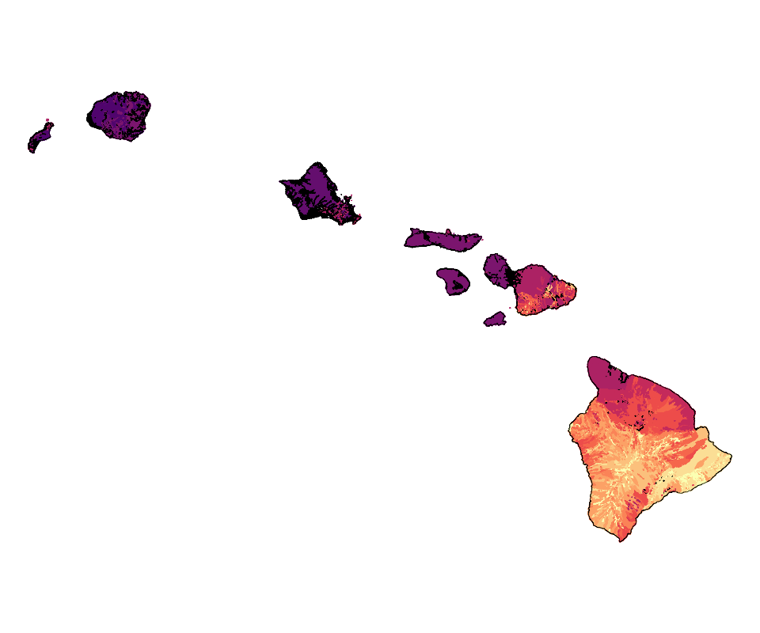
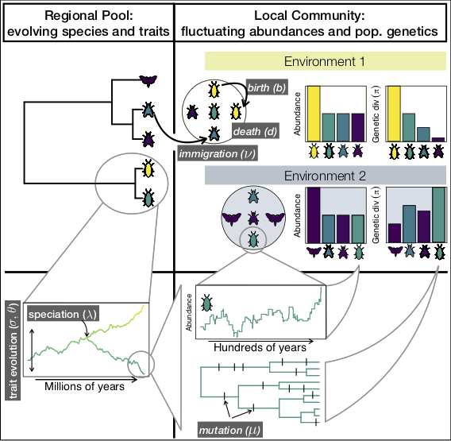

---
title: Diversity informatics for all
author: Andrew Rominger
mode  : selfcontained
framework: impressjs
widgets: mathjax
github:
  user: ajrominger
  repo: talks 
url:
  lib: ../libraries
--- #overview x:3000 y:2500 scale:1

--- #hawaii x:0 y:2500 scale:4
```{r, fig.width = 3, fig.height = 2, echo = FALSE, eval = TRUE, message = FALSE}

```

--- #bugs x:2500 y:-100 z:-500 rot:50 scale:5
```{r, fig.width = 3, fig.height = 2, echo = FALSE, eval = TRUE, message = FALSE}

```

--- #theory x:6000 y:1000 z:-1000 rot:140 scale:5
```{r, echo = FALSE, eval = TRUE, message = FALSE}
# rates through time

```

--- #hypotheses x:4500 y:3500 z:-1500 rot:230 scale:6
```{r, echo = FALSE, eval = TRUE, message = FALSE}
knitr::include_graphics('assets/fig/hyp.png')
```

--- #db x:3500 y:2000 z:-2000 rot:320 scale:3
```{r, echo = FALSE, eval = TRUE, message = FALSE}
# rates through time
knitr::include_graphics('assets/fig/db_transHalf.png')
```

