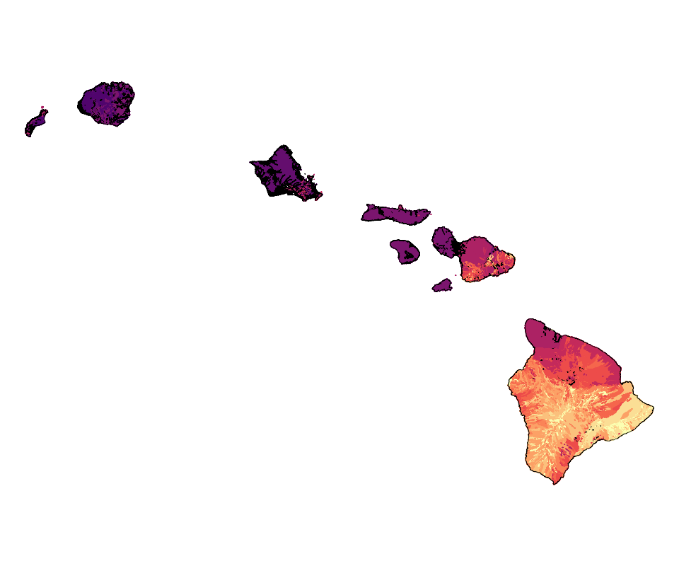
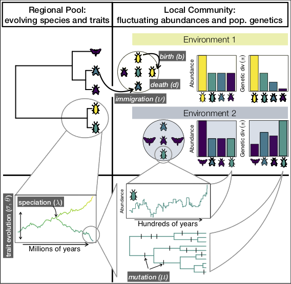
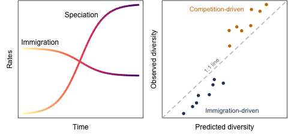
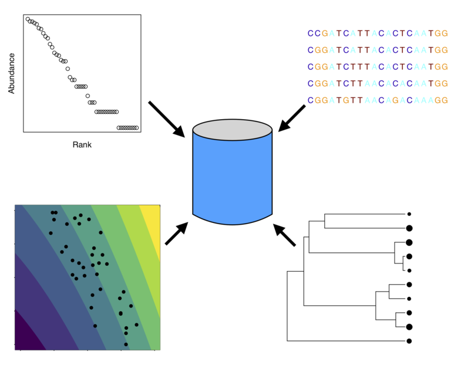

---
title: Diversity informatics for all
author: Andrew Rominger
mode  : selfcontained
framework: impressjs
widgets: mathjax
github:
  user: ajrominger
  repo: talks 
url:
  lib: ../libraries
--- #overview x:3000 y:2500 scale:1

--- #hawaii x:0 y:2500 scale:4

--- #bugs x:2500 y:-100 z:-500 rot:50 scale:5

--- #theory x:6000 y:1000 z:-1000 rot:140 scale:5

--- #hypotheses x:4500 y:3500 z:-1500 rot:230 scale:6

--- #db x:3500 y:2000 z:-2000 rot:320 scale:3

