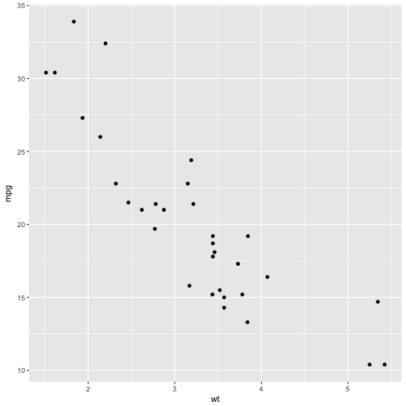

---
title: Diversity informatics for all
author: Andrew Rominger
mode  : selfcontained
framework: impressjs
github:
  user: ajrominger
  repo: talks 
url:
  lib: ../libraries
--- #overview x:3000 y:2500 scale:1

--- #hawaii x:0 y:0 scale:4

```
## OGR data source with driver: ESRI Shapefile 
## Source: "/Users/ajr/Dropbox/hawaiiDimensions/geoData/env_data/geol", layer: "Haw_St_geo_20070426_region"
## with 9862 features
## It has 15 fields
## Integer64 fields read as strings:  ID STRAT_CODE AGE_GROUP
```

```
## Warning in file(file, "rt"): cannot open file '../Haw_St_ageCode.csv': No
## such file or directory
```

```
## Error in file(file, "rt"): cannot open the connection
```

--- #its x:850 y:3000 rot:45 scale:5

 It's a **presentation tool** <br/>
inspired by the idea behind [prezi.com](http://prezi.com) <br/>
and based on the **power of CSS3 transforms and transitions** in modern browsers.

--- #big x:3500 y:2100 rot:180 scale:6

visualize your <b>big</b> <span class="thoughts">thoughts</span>

--- #tiny x:2825 y:2325 z:-3000 rot:300 scale:1

and **tiny** ideas

--- #ing x:3500 y:-850 rot:270 scale:6
by <b class="positioning">positioning</b>, <b class="rotating">rotating</b> and <b class="scaling">scaling</b> them on an infinite canvas

--- #imagination x:6700 y:-300 scale:6

the only **limit** is your <b class="imagination">imagination</b>

--- #source x:6300 y:2000 rot:20 scale:4

want to know more?

[use the source](http://github.com/bartaz/impress.js), Luke

--- #one-more-thing x:6000 y:4000 scale:2

one more thing...

--- #its-in-3d x:6200 y:4300 z:-100 rotx:-40 roty:-10 scale:2

<span class="have">have</span> <span class="you">you</span> <span class="noticed">noticed</span> <span class="its">it's</span> <span class="in">in</span> <b>3D<sup>*</sup></b>?

<span class="footnote">* beat that, prezi ;)</span>

--- #rstats x:-1000 y:5000


```r
library(ggplot2)
qplot(wt, mpg, data = mtcars)
```


