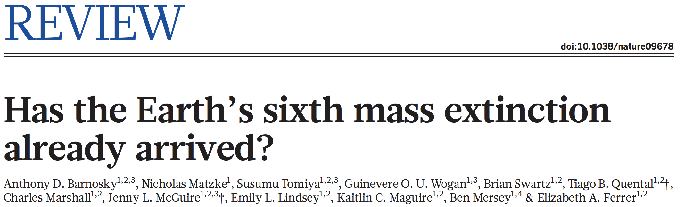
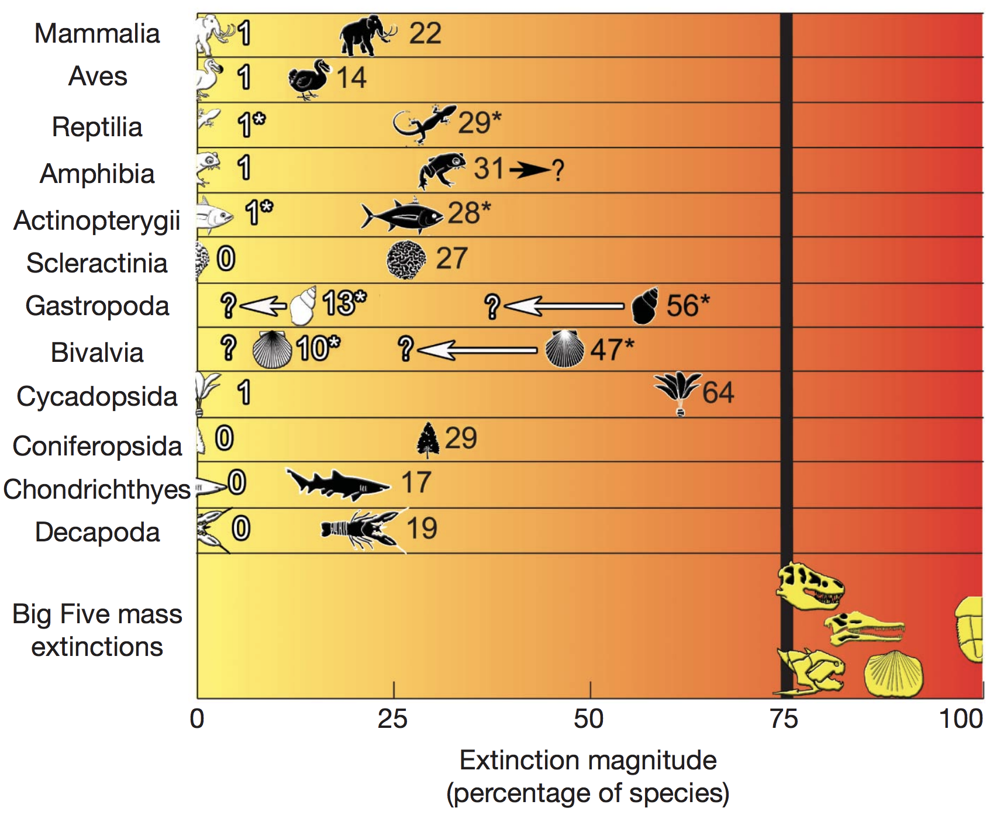
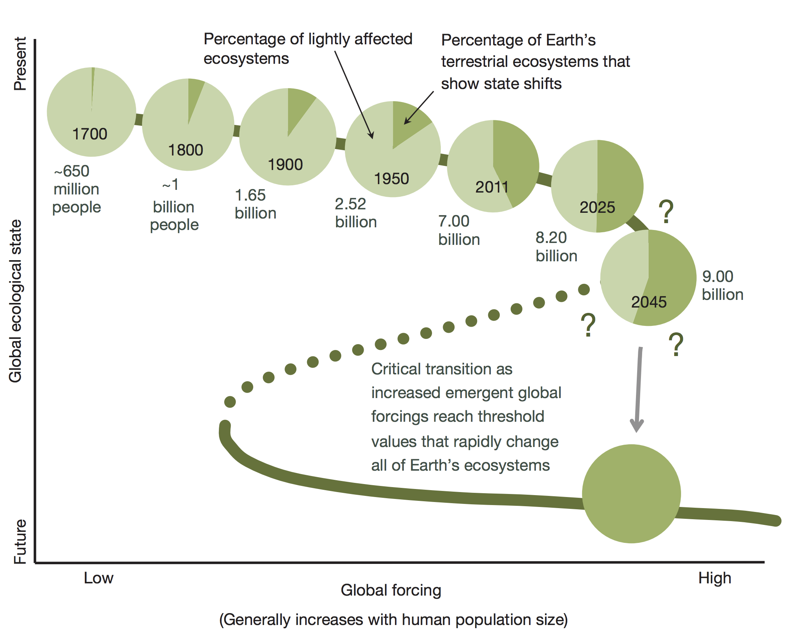
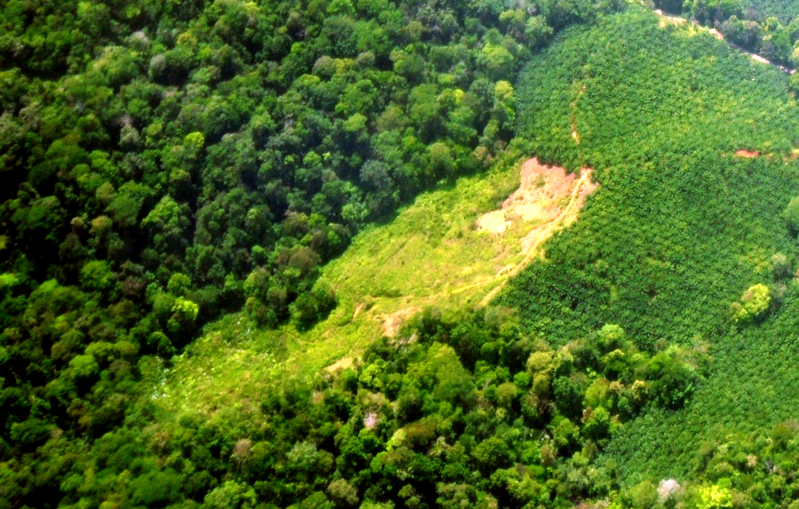
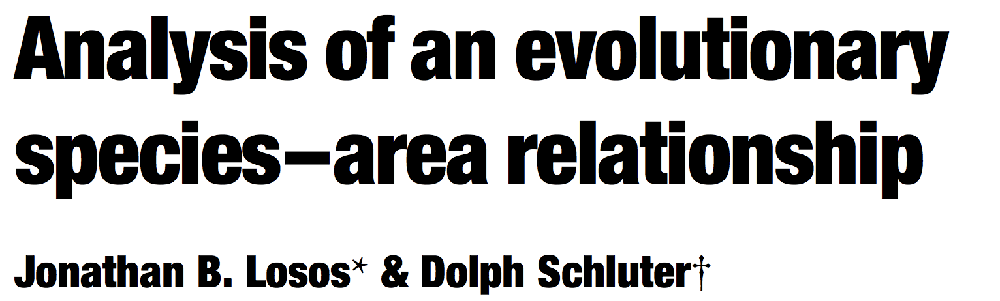
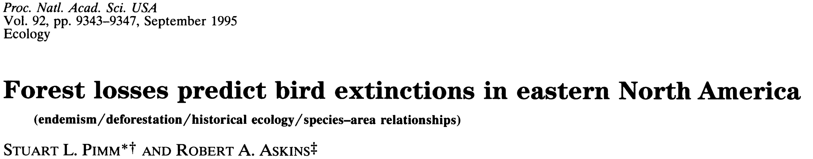
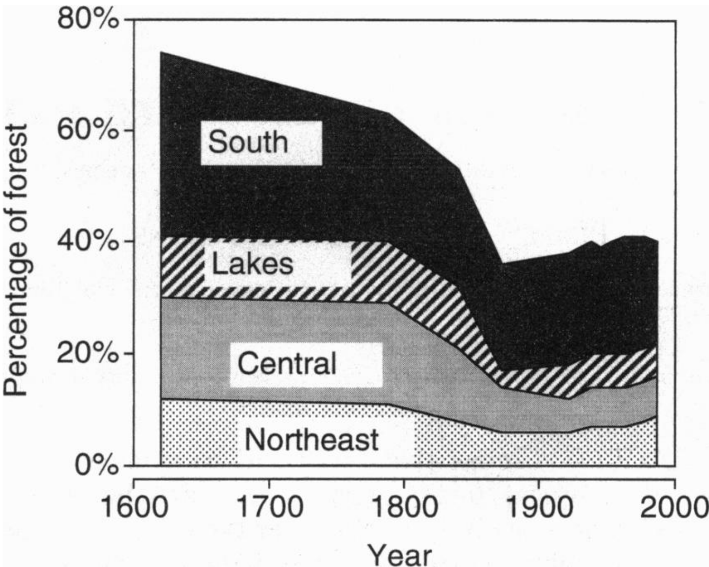
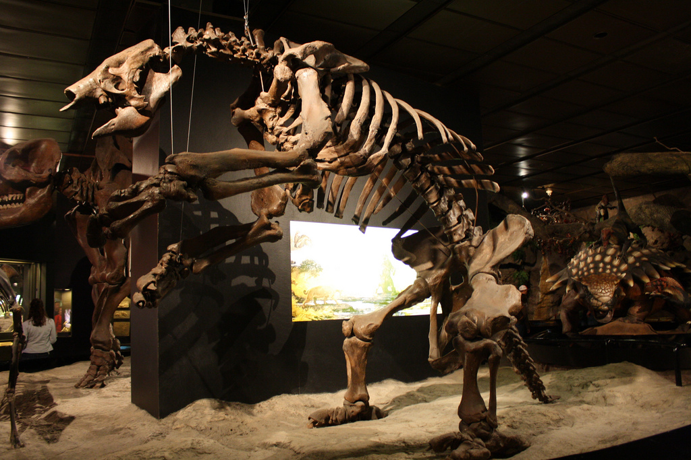
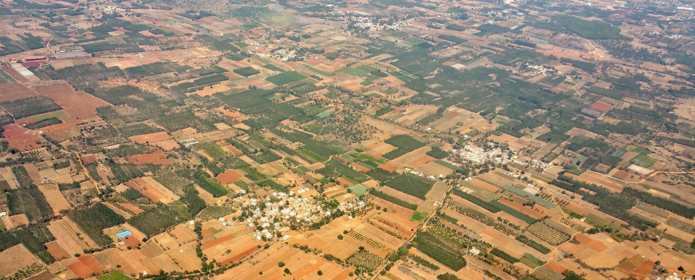
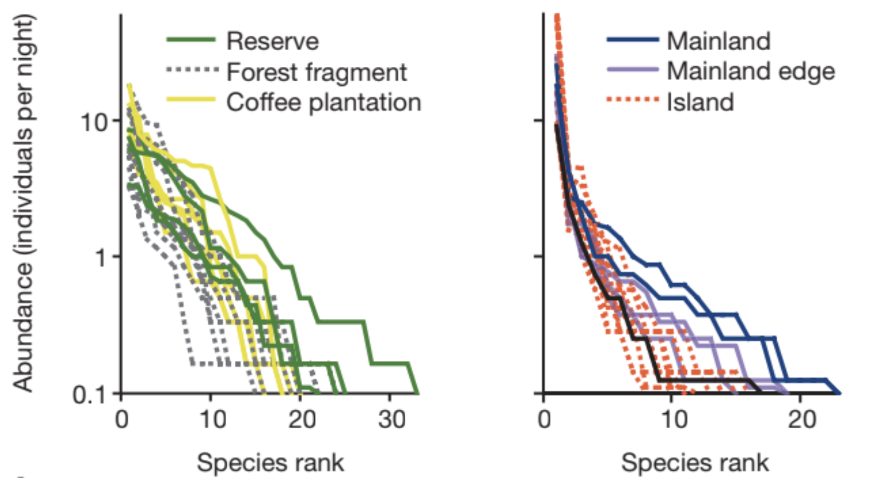

```{r setup, include=FALSE}
library(knitr)
opts_chunk$set(echo = FALSE, message = FALSE)
```

```{css}
slide {
    background-position: center;
    background-repeat: no-repeat;
    background-size: contain;
}
```

```{r deps, include=FALSE}
# this ensures jquery is loaded
dep <- htmltools::htmlDependency(name = "jquery", version = "1.11.3", 
                                 src = system.file("rmd/h/jquery-1.11.3", package='rmarkdown'), 
                                 script = "jquery.min.js")
htmltools::attachDependencies(htmltools::tags$span(''), dep)
```

```{js move-id-background-color}
$(document).ready(function(){
    // for every article tag inside a slide tag
    $("slide > article").each(function(){
        // copy the article name to the parentNode's (the slide) ID
        this.parentNode.id=$(this).attr('name');
    });
});
```

```{r background-function,include=FALSE}
makeBG <- function(id, file)
{
    cat(
        sprintf('<style type="text/css">\n#%s {\nbackground-image: url(%s);\n}\n</style>',
                id, knitr::image_uri(file))
    )
}
```

<style>
foot {
  position: absolute;
  bottom: 0;
  margin-bottom: 50px;
  width: 80%;
  font-size: 0.6em;
}
</style>

<!--- ######## START OF TALK ######## -->


## {.SlideClass #SlideID name=ThisSlide .flexbox .vcenter}

```{r results='asis',echo=FALSE}
makeBG(id='ThisSlide', 'biodiv.jpg') 
```
 
<span style="font-size: 64px; color:#FFFFFF;">Biodiversity</span>


##
```{r, out.width='600px', fig.align='center'}

```
<br/>
```{r, out.width='450px', fig.align='center'}

```


## Biodiversity suports human life

```{r, fig.align='center', fig.width=6, fig.height=4.5, warning=FALSE}
library(igraph)

x <- read.table('eco_service_net.txt', header = TRUE, row.names = 1, sep = '\t')
x[is.na(x)] <- 0
x <- as.matrix(x)
colnames(x) <- rownames(x) <- gsub(' ', '\n', rownames(x))

g <- graph_from_adjacency_matrix(x)
nv <- length(V(g))

l <- expand.grid(-2:2, 1:4)
l <- as.matrix(rbind(l, c(0, 2)))
# l <- cbind(c(cos(seq(0, 2*pi - pi/10, length.out = nv - 1)), 0) * c(1.25, 2), 
#            c(sin(seq(0, 2*pi - pi/10, length.out = nv - 1)), 0) * c(1.25, 2))

par(mar = rep(0, 4))
plot(g, 
     vertex.label.color = c(rep('white', nv - 1), 'transparent'), 
     vertex.size = 42, 
     vertex.color = c(rep(hsv(0.4, 0.4, 0.7), nv - 1), hsv(alpha = 0)), 
     vertex.label.cex = 1.2, 
     edge.arrow.size = 0.5, 
     edge.color = 'transparent',
     layout = l, 
     asp = 0)
```

<foot>Millennium Assessment Board (2005). *Millennium Ecosystem Assessment*</foot>


## Open questions
- How much biodiversity is required to provision services?
- How does the current extinction rate compare to background extinction?
- Are changes to biodiversity largely reversible or irreversible?
- Is the biodiversity in any given ecosystem in equilibrium or not?
- How severe is the trade-off between human use of natural resources versus biodiversity?


## Biodiversity and ecosystem function

Diversity begets productivity

```{r, fig.align='center', fig.width=5, fig.height=4}
par(mar = c(2, 2, 0, 0) + 0.5, mgp = c(1, 1, 0), cex.lab = 1.4)
curve(1/(1 + exp(-x)), from = 1, to = 4, lwd = 3,
      axes = FALSE, frame.plot = TRUE, 
      xlab = 'Number of species', ylab = 'Ecosystem productivity')
```

<foot>Reviewed in Duffy (2009) *Front. Ecol. Environ.*</foot>


## Biodiversity and ecosystem function

Diversity begets stability

```{r, fig.align='center', fig.width=5, fig.height=4}
par(mar = c(2, 2, 0, 0) + 0.5, mgp = c(1, 1, 0), cex.lab = 1.4)
curve(exp(-x), from = 1, to = 4, lwd = 3,
      axes = FALSE, frame.plot = TRUE, 
      xlab = 'Number of species', ylab = 'Recovery rate after perterbation')
```

<foot>Reviewed in Duffy (2009) *Front. Ecol. Environ.*</foot>


## Biodiversity and ecosystem function

```{r, fig.align='center', fig.width=5, fig.height=5, warning=FALSE}
x <- read.table('eco_service_net.txt', header = TRUE, row.names = 1, sep = '\t')
x[is.na(x)] <- 0
x <- as.matrix(x)
colnames(x) <- rownames(x) <- gsub(' ', '\n', rownames(x))

g <- graph_from_adjacency_matrix(x)
nv <- length(V(g))

l <- cbind(c(cos(seq(0, 2*pi - pi/10, length.out = nv - 1)), 0) * c(1.5, 2.25), 
           c(sin(seq(0, 2*pi - pi/10, length.out = nv - 1)), 0) * c(1.5, 2.25))

par(mar = rep(0, 4))
plot(g, 
     vertex.label.color = 'white', 
     vertex.size = 40, 
     vertex.color = c(rep(hsv(0.4, 0.4, 0.7), nv - 1), hsv(0.6, 0.8, 0.8)), 
     vertex.label.cex = 1, 
     edge.arrow.size = 0.5, 
     layout = l)
```

<foot>Millennium Assessment Board (2005). *Millennium Ecosystem Assessment*</foot>


## Biodiversity and ecosystem function

```{r, fig.align='center', fig.width=7, fig.height=5}
x <- matrix(1, nrow = 2, ncol = 2)
diag(x) <- 0
rownames(x) <- colnames(x) <- c('diverse\necosystems', 'human\nlife')

g <- graph_from_adjacency_matrix(x)


l <- matrix(c(0, 2, 1, 1), ncol = 2)

par(mar = rep(0, 4))
plot(g, 
     vertex.label.color = 'white', 
     vertex.size = 60, 
     vertex.color = c(hsv(0.4, 0.4, 0.7), hsv(0.6, 0.8, 0.8)), 
     vertex.label.cex = 1.5, 
     edge.arrow.size = 2,
     edge.width = 2,
     edge.curved = TRUE,
     layout = l,
     rescale = FALSE,
     xlim = c(-0.5, 2.5), ylim = c(0, 2),
     asp = 0
     )
```

<foot>Millennium Assessment Board (2005). *Millennium Ecosystem Assessment*</foot>


## Biodiversity and ecosystem function

Are we irreversibly altering biodiversity and ecosystems?

```{r, fig.width=5, fig.align='center', out.width='500px'}

```

<foot>Barnosky et al. (2012). *Nature*</foot>


## Biodiversity and ecosystem function

Are we irreversibly altering biodiversity and ecosystems?

```{r, fig.width=5, fig.align='center', out.width='500px'}

```

40% land conversion globally

<foot>Barnosky et al. (2012) *Nature;* Foley et al. (2005) *Nature*</foot>


## Area and isolation

A long precedent for viewing habitat fragments as islands

```{r, fig.width=6, fig.height=4, fig.align='center'}
islandOutline <- function(x, y, R, ...) {
    n <- 25
    r <- rnorm(n, 0, 0.25)
    r <- (r - min(r) + 1) * R
    
    a <- seq(0, 2 * pi - 2 * pi / n, length.out = n)
    
    polygon(spline(1:n, cos(a) * r + x, xout = seq(1, n, length.out = 100))$y, 
            spline(1:n, sin(a) * r + y, xout = seq(1, n, length.out = 100))$y, 
            ...)
}

par(mar = rep(0, 4))
plot(1:20, type = 'n', axes = FALSE)

set.seed(3)
islandOutline(3.5, 5, 2, col = hsv(0.425, 0.7, 0.8))
islandOutline(6, 15, 1.25, col = hsv(0.35, 0.4, 0.8))
set.seed(1)
islandOutline(23, 13, 8, col = hsv(0.45, 0.7, 0.7))

text(c(3.5, 6, 16), c(5, 15, 16), 
     labels = c('"island"', '"island"', '"mainland"'), 
     col = 'white', cex = 1.2)

box()
```

<foot>Diamond et al. (1976) *Science*</foot>


## Area and isolation

Equilibrium island biogeography theory

```{r, fig.width=6, fig.height=4.25, fig.align='center'}
ab <- function(a, b) {
    if(missing(a)) return(exp(b - 1))
    if(missing(b)) return(1 + log(a))
}

imm <- function(x, a, b) {
    if(missing(a)) a <- ab(b = b)
    if(missing(b)) b <- ab(a = a)
    
    return(a * exp(-b*x))
}

ext <- function(x, a, b) {
    if(missing(a)) a <- ab(b = b)
    if(missing(b)) b <- ab(a = a)
    
    return(a * exp(b*(x - 1)))
}

Shat <- function(a_imm, a_ext) {
    b_imm <- ab(a = a_imm)
    b_ext <- ab(a = a_ext)
    
    return((log(a_imm) - log(a_ext) + b_ext) / (b_ext + b_imm))
}

macWilson <- function(a_imm, a_ext, i) {
    curve(imm(x, a_imm), add = TRUE, from = 0.3, to = 0.7, col = 'blue', lwd = 2)
    curve(ext(x, a_ext), add = TRUE, from = 0.3, to = 0.7, col = 'red', lwd = 2)
    
    segments(x0 = Shat(a_imm, a_ext), y0 = par('usr')[1], y1 = imm(Shat(a_imm, a_ext), a_imm),
             col='gray')
    
    axis(1, at = Shat(a_imm, a_ext), labels = eval(bquote(expression(hat(S)[.(i)]))))
}

areas <- c(10, 100, 1000)
z <- 0.25
a <- exp(areas^-z)

par(mar = c(3.5, 2, 0, 0)+0.1, cex.lab = 1.5, mgp = c(2.25, 1, 0))
plot(1, type = 'n', xlim = c(0.22, 0.78), ylim = c(imm(0.7, a = a[3]), imm(0.3, a = a[1]) * 1.025), 
     axes = FALSE, frame.plot = TRUE, xlab = 'Number of species', ylab = '')

text(c(0.33, 0.67), c(1.05, 1.05), labels=c('Immigration', 'Extinction'),
     col=c('blue', 'red'), cex=1.5, pos=c(4, 2))

mtext('Rate', side=2, line=0.75, cex=1.5)

macWilson(a[1], a[1], 'j')
```

<foot>MacArthur & Wilson (1976) *The theory of island biogeography*</foot>


## Area and isolation

Equilibrium island biogeography theory

```{r, fig.width=6, fig.height=4.25, fig.align='center'}
par(mar = c(3.5, 2, 0, 0)+0.1, cex.lab = 1.5, mgp = c(2.25, 1, 0))
plot(1, type = 'n', xlim = c(0.22, 0.78), ylim = c(imm(0.7, a = a[3]), imm(0.3, a = a[1]) * 1.025), 
     axes = FALSE, frame.plot = TRUE, xlab = 'Number of species', ylab = '')

text(c(0.33, 0.67), c(1.05, 1.05), labels=c('Immigration', 'Extinction'),
     col=c('blue', 'red'), cex=1.5, pos=c(4, 2))

mtext('Rate', side = 2, line=0.75, cex=1.5)

macWilson(a[1], a[1], 'j')
macWilson(a[3], a[1], 'i')

arrows(x0=0.25, y0=imm(0.3, a[1]), y1=imm(0.3, a[3]), col=hsv(0.6, 0.7), lwd=6, length=0.1)
text(0.25, mean(imm(0.3, a[c(1, 3)])), labels='Increasing isolation', 
     srt=90, adj=c(0.5, -1), col='blue', cex = 1.25)
```

<foot>MacArthur & Wilson (1976) *The theory of island biogeography*</foot>


## Area and isolation

Equilibrium island biogeography theory

```{r, fig.width=6, fig.height=4.25, fig.align='center'}
par(mar = c(3.5, 2, 0, 0)+0.1, cex.lab = 1.5, mgp = c(2.25, 1, 0))
plot(1, type = 'n', xlim = c(0.22, 0.78), ylim = c(imm(0.7, a = a[3]), imm(0.3, a = a[1]) * 1.025), 
     axes = FALSE, frame.plot = TRUE, xlab = 'Number of species', ylab = '')

text(c(0.33, 0.67), c(1.05, 1.05), labels=c('Immigration', 'Extinction'),
     col=c('blue', 'red'), cex=1.5, pos=c(4, 2))

mtext('Rate', side=2, line=0.75, cex=1.5)

macWilson(a[1], a[1], 'j')
macWilson(a[3], a[1], 'i')
macWilson(a[1], a[3], 'k')

arrows(x0=0.25, y0=imm(0.3, a[1]), y1=imm(0.3, a[3]), col=hsv(0.6, 0.7), lwd=6, length=0.1)
text(0.25, mean(imm(0.3, a[c(1, 3)])), labels='Increasing isolation', 
     srt=90, adj=c(0.5, -1), col='blue', cex=1.25)

arrows(x0=0.75, y0=ext(0.7, a[1]), y1=ext(0.7, a[3]), col=hsv(0, 0.5), lwd=6, length=0.1)
text(0.75, mean(ext(0.7, a[c(1, 3)])), labels='Increasing area', 
     srt=90, adj=c(0.5, 1.5), col='red', cex=1.25)
```

<foot>MacArthur & Wilson (1976) *The theory of island biogeography*</foot>


## Area and isolation

Human activity: direct conversion

```{r, fig.width=5, fig.align='center', out.width='500px'}

```


## Area and isolation

Human activity: climate change

```{r, fig.width=5, fig.align='center', fig.width=5, fig.height=4}
elev <- function(x) {
    dnorm(x, -1, sd = 1.5) + 0.2 * dnorm(x, 2, sd = 0.5)
}


# elevCrit <- 0.15
xCrit <- function(e, range) {
    uniroot(function(x) elev(x) - e, range)$root
}

elevCrit1 <- 0.1
elevCrit2 <- 0.15
x1 <- seq(xCrit(elevCrit1, c(-4, 0)), xCrit(elevCrit1, c(0, 3)), length.out = 100)
y1 <- elev(x1)

x21 <- seq(xCrit(elevCrit2, c(-4, -1)), xCrit(elevCrit2, c(-1, 1)), length.out = 50)
x22 <- seq(xCrit(elevCrit2, c(1, 2)), xCrit(elevCrit2, c(2, 3)), length.out = 50)
y21 <- elev(x21)
y22 <- elev(x22)


par(mar = rep(0, 4))
curve(elev(x), from = -4, to = 3, xlab = '', ylab ='', axes = FALSE)
polygon(x1, y1, col = 'gray')
```

## Area and isolation

Human activity: climate change

```{r, fig.width=5, fig.align='center', fig.width=5, fig.height=4}
elevCrit1 <- 0.1
elevCrit2 <- 0.15
x1 <- seq(xCrit(elevCrit1, c(-4, 0)), xCrit(elevCrit1, c(0, 3)), length.out = 100)
y1 <- elev(x1)

x21 <- seq(xCrit(elevCrit2, c(-4, -1)), xCrit(elevCrit2, c(-1, 1)), length.out = 50)
x22 <- seq(xCrit(elevCrit2, c(1, 2)), xCrit(elevCrit2, c(2, 3)), length.out = 50)
y21 <- elev(x21)
y22 <- elev(x22)

par(mar = rep(0, 4))
curve(elev(x), from = -4, to = 3, xlab = '', ylab ='', axes = FALSE)
polygon(x1, y1, col = 'gray')
polygon(x21, y21, col = 'gray25')
polygon(x22, y22, col = 'gray25')
```


## Area and isolation...and evolution

Losing evolutionary history

```{r, fig.width=5, fig.height=4, fig.align='center'}
library(ape)
library(socorro)

set.seed(2)
tre <- rphylo(20, 1, 1)

par(mar = c(3.5, 0, 0, 0))
plot(tre, show.tip.label = FALSE, edge.width = 3)
axisArrows(1, lwd = 2)
mtext('Time', side = 1, line = 1.75, cex = 1.4)
```


## Area and isolation...and evolution

Losing evolutionary history

```{r, fig.width=5, fig.height=4, fig.align='center'}
##### better colors ######
clades <- tre$tip.label
clades <- clades[!(clades %in% c('t4', 't19', 't17'))]
cols <- cladeCol(tre, clades = list('t4', c('t19', 't17'), clades), 
                 cols = c(hsv(s = 0.25), hsv(s = 0.25), 'black'))

par(mar = c(3.5, 0, 0, 0))
plot(tre, edge.color = cols, edge.width = 3, show.tip.label = FALSE)
axisArrows(1, lwd = 2)
mtext('Time', side = 1, line = 1.75, cex = 1.4)
```


## Area and isolation...and evolution

Losing evolutionary history

```{r, fig.width=5, fig.height=4, fig.align='center'}
clades <- tre$tip.label
clades <- clades[!(clades %in% c('t15', 't2', 't1'))]
cols <- cladeCol(tre, clades = list('t15', c('t2', 't1'), clades), 
                 cols = c(hsv(s = 0.25), hsv(s = 0.25), 'black'))

par(mar = c(3.5, 0, 0, 0))
plot(tre, edge.color = cols, edge.width = 3, show.tip.label = FALSE)
axisArrows(1, lwd = 2)
mtext('Time', side = 1, line = 1.75, cex = 1.4)
```


## Area and isolation...and evolution

Losing evolutionary history

- Evolution of novel forms takes $\geq 10^6$ years
- Intensive agriculture erodes evolutionary history

<foot>Karp et al. (2012) *Ecology Letters*; Frishkoff et al. (2014) *Science*</foot>


## Area and isolation...and evolution

```{r, fig.width=5, fig.align='center', out.width='350px'}

```

```{r, fig.width=5, fig.align='center', out.width='350px'}
include_graphics('losos_fig.png')
```


## Area and isolation...and evolution

```{r, fig.width=5, fig.align='center', out.width='500px'}

```

<foot>Barnosky et al. (2012). *Nature*</foot>


## Area and extinction

Species area relationship $\hat{S} = f(A)$

```{r, fig.width=5, fig.height=4, fig.align='center'}
areas <- 10^seq(0, 5, length.out = 10)
z <- 0.25
a <- exp(areas^-z)

par(mar = c(2, 2, 0, 0) + 0.5, mgp = c(1, 1, 0))
plot(areas, Shat(a[1], a), log = 'xy', axes = FALSE, frame.plot = TRUE, 
     cex = 2, pch = 16, cex.lab = 1.5,
     xlab = 'Area', ylab = 'Species')
```


## Area and extinction

Species extinctions: $\hat{S}_\text{new} = \hat{S}(A_\text{orig} - A_\text{loss})$

$\Rightarrow \hat{S}_\text{extinct} = \hat{S}(A_\text{orig}) - \hat{S}(A_\text{orig} - A_\text{loss})$


```{r, fig.width=5, fig.height=4, fig.align='center'}
areas <- 10^seq(0, 5, length.out = 10)
z <- 0.25
a <- exp(areas^-z)

par(mar = c(2, 2, 0, 0) + 0.5, mgp = c(1, 1, 0))
plot(areas, Shat(a[1], a), log = 'xy', axes = FALSE, frame.plot = TRUE, 
     cex = 2, pch = 16, cex.lab = 1.5,
     xlab = 'Area', ylab = 'Species', 
     panel.first = rect(10^par('usr')[1], 10^par('usr')[3], 
                        areas[6], Shat(a[1], a[6]), 
                        col = 'gray'))
```


## Area and extinction

Species area relationship (classic): $S = cA^z$

More nuanced approach: $S = cA^{z(A)}$

```{r, fig.width=5, fig.height=4, fig.align='center'}
areas <- 10^seq(0, 5, length.out = 10)
z <- 0.25
a <- exp(areas^-z)

par(mar = c(2, 2, 0, 0) + 0.5, mgp = c(1, 1, 0))
# plot(areas, Shat(a[1], a), log = 'xy', axes = FALSE, frame.plot = TRUE, 
#      cex = 2, pch = 16, cex.lab = 1.5,
#      xlab = 'Area', ylab = 'Species')
plot(log(areas), log(Shat(a[1], a)), axes = FALSE, frame.plot = TRUE, 
     cex = 2, pch = 16, cex.lab = 1.5,
     xlab = 'Area', ylab = 'Species')

curve(-0.695 + 0.045 * x, add = TRUE, to = 6, lwd = 2)
curve(-0.65 + 0.09 * log(x+0.25), add = TRUE, lwd = 2)
```

<foot>Harte et al. (2009) *Ecology Letters*</foot>


## Area and extinction 

```{r, out.width='650px', fig.align='center'}

```
<br/>
<div class="columns-2">
```{r, out.width='350px', fig.align='center'}

```


- Assumes:
    - 200 bird species
    - $S = cA^{0.25}$
- Predicts 32 extinctions 
- 4 extinctions observed
</div>

## Where are all the extinctions?


## Where are all the extinctions?

Extinction debt
```{r, fig.width=6, fig.height=4.25, fig.align='center'}
areas <- c(10, 100, 1000)
z <- 0.25
a <- exp(areas^-z)

par(mar = c(3.5, 2, 0, 0)+0.1, cex.lab = 1.5, mgp = c(2.25, 1, 0))
plot(1, type = 'n', xlim = c(0.22, 0.78), 
     ylim = c(imm(0.7, a = a[3]), imm(0.3, a = a[1]) * 1.025), 
     axes = FALSE, frame.plot = TRUE, xlab = 'Number of species', ylab = '')

text(c(0.33, 0.67), c(1.05, 1.05), labels=c('Immigration', 'Extinction'),
     col=c('blue', 'red'), cex=1.5, pos=c(4, 2))

mtext('Rate', side=2, line=0.75, cex=1.5)

macWilson(a[1], a[1], 'j')
macWilson(a[1], a[3], 'k')

arrows(x0 = 0.75, y1 = ext(0.7, a[1]), y0 = ext(0.7, a[3]), col=hsv(0, 0.5), lwd=6, length=0.1)
text(0.75, mean(ext(0.7, a[c(1, 3)])), labels='Decreasing area', 
     srt=90, adj=c(0.5, 1.5), col='red', cex=1.25)
```

<foot>MacArthur & Wilson (1976) *The theory of island biogeography*</foot>


## Where are all the extinctions?

Extinction debt
```{r, fig.width=5, fig.height=4.5, fig.align='center'}
graphics::layout(matrix(3:1, ncol = 1))
par(mar = c(0, 3, 0, 0) + 0.25, oma = c(3.25, 0, 0, 0), mgp = c(1, 1, 0), cex.lab = 1.5)

plot(1, xlim = c(-5, 5), ylim = c(0, 1), xlab = '', ylab = 'Area', 
     axes = FALSE, type = 'n')
abline(v = 0, lwd = 5, col = 'gray')
box()

segments(-5, 0.75, 0, 0.75, lwd = 3)
segments(0, 0.75, 0, 0.25, lwd = 3)
segments(0, 0.25, 5, 0.25, lwd = 3)

mtext('Time', side = 1, outer = TRUE, line = 1)


plot(1, xlim = c(-5, 5), ylim = c(0, 1.15), xlab = '', ylab = '', 
     axes = FALSE, type = 'n')
# abline(v = 0, lwd = 5, col = 'gray')
# box()
# 
# segments(-5, 0.25, 0, 0.25, lwd = 3)
# segments(0, 0.25, 0, 0.5, lwd = 3)
# curve(1/(1 + exp(-x)), from = 0, add = TRUE, lwd = 3)


plot(1, xlim = c(-2, 2), ylim = c(0, 1), xlab = '', ylab = '', 
     axes = FALSE, type = 'n')
# abline(v = 0, lwd = 5, col = 'gray')
# box()
# 
# segments(-2, 1, 0, 1, lwd = 3)
# curve(exp(-x), from = 0, add = TRUE, lwd = 3)
```

<foot>Reviewed in Kuussaari et al. (2009) *TREE*</foot>

## Where are all the extinctions?

Extinction debt
```{r, fig.width=5, fig.height=4.5, fig.align='center'}
graphics::layout(matrix(3:1, ncol = 1))
par(mar = c(0, 3, 0, 0) + 0.25, oma = c(3.25, 0, 0, 0), mgp = c(1, 1, 0), cex.lab = 1.5)

plot(1, xlim = c(-5, 5), ylim = c(0, 1), xlab = '', ylab = 'Area', 
     axes = FALSE, type = 'n')
abline(v = 0, lwd = 5, col = 'gray')
box()

segments(-5, 0.75, 0, 0.75, lwd = 3)
segments(0, 0.75, 0, 0.25, lwd = 3)
segments(0, 0.25, 5, 0.25, lwd = 3)

mtext('Time', side = 1, outer = TRUE, line = 1)


plot(1, xlim = c(-5, 5), ylim = c(-0.1, 2), xlab = '', ylab = 'Extinction rate', 
     axes = FALSE, type = 'n')
abline(v = 0, lwd = 5, col = 'gray')
box()

segments(-5, 0.25, 0, 0.25, lwd = 3)
segments(0, 0.25, 0, 1.75, lwd = 3)
curve(exp(-x) + 0.75, from = 0, add = TRUE, lwd = 3)


plot(1, xlim = c(-2, 2), ylim = c(0, 1), xlab = '', ylab = '', 
     axes = FALSE, type = 'n')
# abline(v = 0, lwd = 5, col = 'gray')
# box()
# 
# segments(-2, 1, 0, 1, lwd = 3)
# curve(exp(-x), from = 0, add = TRUE, lwd = 3)
```

<foot>Reviewed in Kuussaari et al. (2009) *TREE*</foot>


## Where are all the extinctions?

Extinction debt
```{r, fig.width=5, fig.height=4.5, fig.align='center'}
graphics::layout(matrix(3:1, ncol = 1))
par(mar = c(0, 3, 0, 0) + 0.25, oma = c(3.25, 0, 0, 0), mgp = c(1, 1, 0), cex.lab = 1.5)

plot(1, xlim = c(-5, 5), ylim = c(0, 1), xlab = '', ylab = 'Area', 
     axes = FALSE, type = 'n')
abline(v = 0, lwd = 5, col = 'gray')
box()

segments(-5, 0.75, 0, 0.75, lwd = 3)
segments(0, 0.75, 0, 0.25, lwd = 3)
segments(0, 0.25, 5, 0.25, lwd = 3)

mtext('Time', side = 1, outer = TRUE, line = 1)


plot(1, xlim = c(-5, 5), ylim = c(-0.1, 2), xlab = '', ylab = 'Extinction rate', 
     axes = FALSE, type = 'n')
abline(v = 0, lwd = 5, col = 'gray')
box()

segments(-5, 0.25, 0, 0.25, lwd = 3)
segments(0, 0.25, 0, 1.75, lwd = 3)
curve(exp(-x) + 0.75, from = 0, add = TRUE, lwd = 3)


plot(1, xlim = c(-2, 2), ylim = c(0, 1), xlab = '', ylab = 'Species', 
     axes = FALSE, type = 'n')
abline(v = 0, lwd = 5, col = 'gray')
box()

segments(-2, 1, 0, 1, lwd = 3)
curve(exp(-x), from = 0, add = TRUE, lwd = 3)
```

<foot>Reviewed in Kuussaari et al. (2009) *TREE*</foot>


## Where are all the extinctions?

Extinction debt: species interactions

<div class="columns-2">
```{r, out.width='350px', fig.align='right'}

```

<br/>
<br/>
<br/>

```{r, out.width='350px', fig.align='left'}
include_graphics('mora_seed.jpg')
```
<br/>

Extinct in 26,600 years

</div>

<foot>Doughty et al. (2016) *Ecography*</foot>


## Where are all the extinctions?

Spatial configuration

<div class="columns-2">
```{r, fig.height=3, fig.width=3, fig.align='right'}
cols <- hsv(c(0, 0.12, 0.17, 0.5, 0.6, 0.8), 
            c(0.7, 1, 0.8, 1, 0.7, 1), 
            c(0.8, 0.8, 1, 0.8, 0.8, 0.6))[-3]

n <- 200
xy <- expand.grid(1:sqrt(n), 1:sqrt(n)) + matrix(rnorm(n * 2, sd = 0.2), ncol = 2)

par(mar = rep(0, 4))
plot(xy, bg = sample(cols, n, replace = TRUE), pch = 21, cex = 2)
```


```{r, fig.height=3, fig.width=3, fig.align='left'}
spCenters <- xy[sample(n, length(cols)), ]
spDist <- apply(spCenters, 1, function(z) {
    sqrt((z[1] - xy[, 1])^2 + (z[2] - xy[, 2])^2)
})
spID <- apply(spDist, 1, function(d) sample(length(cols), 1, prob = exp(-d)))

par(mar = rep(0, 4))
plot(xy, bg = cols[spID], pch = 21, cex = 2)
```
</div>
<center>Different extinction potential</center>

<foot>He and Hubbell (2011) *Nature*; Keil et al. (2015) *Nature Communications*</foot>


## Where are all the extinctions?

Spatial configuration

<div class="columns-2">
```{r, fig.height=3, fig.width=3, fig.align='right'}
par(mar = rep(0, 4))
symbols(1, 1, circles = 0.4, inches = FALSE, bg = 'gray20')
symbols(1, 1, circles = 0.2, inches = FALSE, bg = hsv(0.4, 0.8, 0.7), add = TRUE)
arrows(1.4, 1, 1.2, length = 0.1, col = 'white', lwd = 2)
text(1.3, 1, labels = 'habitat\nloss', pos = 3, col = 'white')
```


```{r, fig.height=3, fig.width=3, fig.align='left'}
par(mar = rep(0, 4))
symbols(1, 1, circles = 0.4, inches = FALSE, bg = hsv(0.4, 0.8, 0.7))
symbols(1, 1, circles = 0.2, inches = FALSE, bg = 'gray20', add = TRUE)
arrows(1, 1, 1.2, length = 0.1, col = 'white', lwd = 2)
text(1.1, 1, labels = 'habitat\nloss', pos = 3, col = 'white')
```
</div>
<center>Different extinction potential</center>

<foot>He and Hubbell (2011) *Nature*; Keil et al. (2015) *Nature Communications*</foot>


## Where are all the extinctions?

False dichotomy between social and natural systems

```{r, out.width='800px', fig.align='center'}

```

Ecosystems used by humans are not inhospitable "oceans"


## Where are all the extinctions?

Especially when human use is diverse

```{r, out.width='600px', fig.align='center'}
include_graphics('mendenhall_setup.png')
```

<foot>Mendenhall et al. (2014) *Nature*</foot>


## Where are all the extinctions?

Especially when human use is diverse

```{r, out.width='400px', fig.align='center'}

```

<foot>Mendenhall et al. (2014) *Nature*</foot>


## Biodiversity and human life

```{r, fig.align='center', fig.width=7, fig.height=5}
x <- matrix(1, nrow = 2, ncol = 2)
diag(x) <- 0
rownames(x) <- colnames(x) <- c('diverse\necosystems', 'human\nlife')

g <- graph_from_adjacency_matrix(x)


l <- matrix(c(0, 2, 1, 1), ncol = 2)

par(mar = rep(0, 4))
plot(g, 
     vertex.label.color = 'white', 
     vertex.size = 60, 
     vertex.color = c(hsv(0.4, 0.4, 0.7), hsv(0.6, 0.8, 0.8)), 
     vertex.label.cex = 1.5, 
     edge.arrow.size = 2,
     edge.width = 2,
     edge.curved = TRUE,
     layout = l,
     rescale = FALSE,
     xlim = c(-0.5, 2.5), ylim = c(0, 2),
     asp = 0
     )
```

<foot>Millennium Assessment Board (2005). *Millennium Ecosystem Assessment*</foot>


## Biodiversity and human life {.flexbox .vcenter}

<span>What would a minimum model of human demographics and biodiversity feedbacks look like?</span>


## Bibliography and useful readings

<div style="font-size: 18px;">
Barnosky, A. D., Matzke, N., Tomiya, S., et al. (2011) Has the Earth's sixth mass extinction already arrived? *Nature* **471**: 51.

Barnosky, A. D., Hadly, E. A., Bascompte, J., et al. (2012) Approaching a state shift in Earth's biosphere. *Nature* **486**: 52.

Diamond, J. M., Terborgh, J., Whitcomb, R. F., et al. (1976) Island biogeography and conservation: strategy and limitations. *Science* **193**: 1027.

Doughty, C. E., Wolf, A., Morueta‐Holme, N., et al. (2016). Megafauna extinction, tree species range reduction, and carbon storage in Amazonian forests. *Ecography* **39**: 194.

Frishkoff, L. O., Karp, D. S., M'Gonigle, L. K., et al. (2014) Loss of avian phylogenetic diversity in neotropical agricultural systems. *Science* **345**: 1343.

Harte, J., Smith, A. B., & Storch, D. (2009) Biodiversity scales from plots to biomes with a universal species–area curve. *Ecology Letters* **12**: 789.

Karp, D. S., Rominger, A. J., Zook, J., et al. (2012). Intensive agriculture erodes $\beta$‐diversity at large scales. *Ecology Letters* **15**: 963.
</div>


## Bibliography and useful readings

<div style="font-size: 18px;">
Keil, P., Storch, D., & Jetz, W. (2015) On the decline of biodiversity due to area loss. *Nature Communications* **6**: 8837.

Kuussaari, M., Bommarco, R., Heikkinen, et al. (2009) Extinction debt: a challenge for biodiversity conservation. *Trends in Ecology & Evolution* **24**: 564.

Losos, J. B., & Schluter, D. (2000) Analysis of an evolutionary species–area relationship. *Nature* **408**: 847.

MacArthur, R. H., & Wilson, E. O. (1976) *The theory of island biogeography*. Princeton University Press.

Mendenhall, C. D., Karp, D. S., Meyer, C. F., et al. (2014) Predicting biodiversity change and averting collapse in agricultural landscapes. *Nature* **509**: 213.

</div>

<!---
## {.flexbox .vcenter}
<span style="font-size: 64px; color:#515151;">Thanks!</span>
<br/>
<br/>
Slides at [ajrominger.github.io/talks](ajrominger.github.io/talks)
-->
