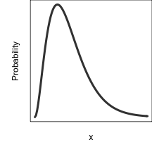
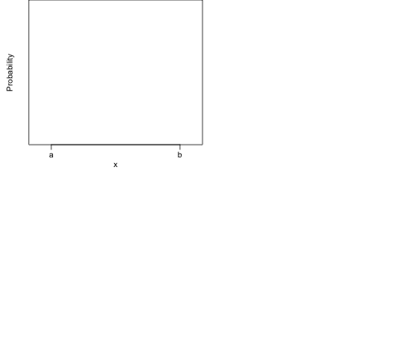
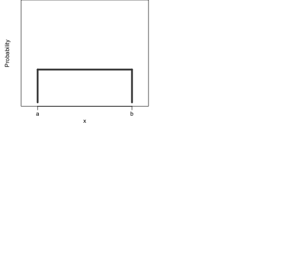
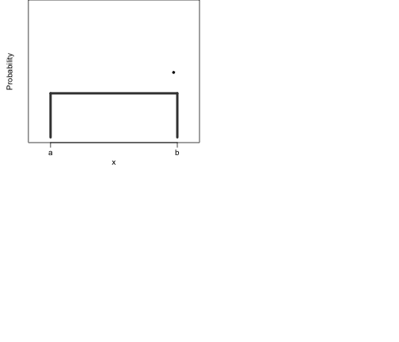

## {.columns-2}


```r
foo <- jpeg::readJPEG('macroeco.jpg', native = TRUE)
```

```
## Error in loadNamespace(name): there is no package called 'jpeg'
```

```r
par(mar = rep(0, 4))
plot(1, axes = FALSE, type = 'n',
     xlim = c(0, dim(foo)[2]), ylim = c(0, dim(foo)[1]),
     xlab = '', ylab = '', asp = 1)
```

```
## Error in plot.default(1, axes = FALSE, type = "n", xlim = c(0, dim(foo)[2]), : object 'foo' not found
```

```r
rasterImage(foo, 0, 0, dim(foo)[2], dim(foo)[1])
```

```
## Error in rasterImage(foo, 0, 0, dim(foo)[2], dim(foo)[1]): object 'foo' not found
```

```r
box()
```

```
## Error in box(): plot.new has not been called yet
```


## {.columns-2}


```r
foo <- jpeg::readJPEG('macroeco.jpg', native = TRUE)
```

```
## Error in loadNamespace(name): there is no package called 'jpeg'
```

```r
par(mar = rep(0, 4))
plot(1, axes = FALSE, type = 'n',
     xlim = c(0, dim(foo)[2]), ylim = c(0, dim(foo)[1]),
     xlab = '', ylab = '', asp = 1)
```

```
## Error in plot.default(1, axes = FALSE, type = "n", xlim = c(0, dim(foo)[2]), : object 'foo' not found
```

```r
rasterImage(foo, 0, 0, dim(foo)[2], dim(foo)[1])
```

```
## Error in rasterImage(foo, 0, 0, dim(foo)[2], dim(foo)[1]): object 'foo' not found
```

```r
box()
```

```
## Error in box(): plot.new has not been called yet
```


```r
library(maps)
```

```
## Error in library(maps): there is no package called 'maps'
```

```r
map('world', 'mexico', col = c(rep('white', 7), 'gray'), fill = TRUE, lwd = 0.01, 
    mar = rep(0, 4))
```

```
## Error in map("world", "mexico", col = c(rep("white", 7), "gray"), fill = TRUE, : could not find function "map"
```

```r
set.seed(3)
x <- runif(20, -107, -103)
y <- -x - 81 + rnorm(length(x), 0, 1.5)
points(x, y)
```

```
## Error in plot.xy(xy.coords(x, y), type = type, ...): plot.new has not been called yet
```

## {.columns-2}


```r
foo <- jpeg::readJPEG('macroeco.jpg', native = TRUE)
```

```
## Error in loadNamespace(name): there is no package called 'jpeg'
```

```r
par(mar = rep(0, 4))
plot(1, axes = FALSE, type = 'n',
     xlim = c(0, dim(foo)[2]), ylim = c(0, dim(foo)[1]),
     xlab = '', ylab = '', asp = 1)
```

```
## Error in plot.default(1, axes = FALSE, type = "n", xlim = c(0, dim(foo)[2]), : object 'foo' not found
```

```r
rasterImage(foo, 0, 0, dim(foo)[2], dim(foo)[1])
```

```
## Error in rasterImage(foo, 0, 0, dim(foo)[2], dim(foo)[1]): object 'foo' not found
```

```r
box()
```

```
## Error in box(): plot.new has not been called yet
```


```r
library(maps)
```

```
## Error in library(maps): there is no package called 'maps'
```

```r
map('world', 'mexico', col = c(rep('white', 7), 'gray'), fill = TRUE, lwd = 0.01, 
    mar = rep(0, 4))
```

```
## Error in map("world", "mexico", col = c(rep("white", 7), "gray"), fill = TRUE, : could not find function "map"
```

```r
set.seed(3)
x <- runif(20, -107, -103)
y <- -x - 81 + rnorm(length(x), 0, 1.5)
points(x, y)
```

```
## Error in plot.xy(xy.coords(x, y), type = type, ...): plot.new has not been called yet
```


```r
library(socorro)
```

```
## Error in library(socorro): there is no package called 'socorro'
```

```r
library(meteR)
```

```
## Error in library(meteR): there is no package called 'meteR'
```

```r
set.seed(1)
x <- sad(meteESF(S0 = 100, N0 = 1000))$r(100)
```

```
## Error in sad(meteESF(S0 = 100, N0 = 1000)): could not find function "sad"
```

```r
par(mar = c(3, 3, 0, 0) + 0.1, mgp = c(1.5, 0.5, 0), mfrow = c(1, 2))
plot(sort(x, TRUE), log = 'y', yaxt = 'n', xlab = 'Rank', ylab = 'Abundance')
```

```
## Warning in xy.coords(x, y, xlabel, ylabel, log): 20 y values <= 0 omitted
## from logarithmic plot
```

```
## Warning in min(x): no non-missing arguments to min; returning Inf
```

```
## Warning in max(x): no non-missing arguments to max; returning -Inf
```

```
## Error in plot.window(...): need finite 'ylim' values
```

```r
logAxis(2)
```

```
## Error in logAxis(2): could not find function "logAxis"
```

```r
plot(exp(2:9), seq(3, 100, length.out = 8), log = 'xy', axes = FALSE, frame.plot = TRUE, 
     xlab = 'Area', ylab = 'Species', ylim = c(2, 110))
```


```r
logAxis(1)
```

```
## Error in logAxis(1): could not find function "logAxis"
```

```r
logAxis(2)
```

```
## Error in logAxis(2): could not find function "logAxis"
```

## <span style="color: #FFFFFF">Maximum Entropy</span>

```r
par(mar = c(3, 3, 0, 0), mgp = c(1, 0, 0))
curve(dgamma(x, 3, 1), from = 0, to = 10, xlab = 'x', ylab = 'Probability', 
      axes = FALSE, frame.plot = TRUE, lwd = 4, col = 'gray25')
```


## Maximum Entropy

```r
par(mar = c(3, 3, 0, 0), mgp = c(1, 0, 0))
curve(dgamma(x, 3, 1), from = 0, to = 10, xlab = 'x', ylab = 'Probability', 
      axes = FALSE, frame.plot = TRUE, lwd = 4, col = 'gray25')
```




## Maximum Entropy

```r
par(mar = c(3, 3, 0, 0), mgp = c(1.5, 0.5, 0), mfcol = c(2, 2))
plot(1, type = 'n', xlim = 0:1, ylim = c(0, 1.5), xlab = 'x', ylab = 'Probability', 
     axes = FALSE, frame.plot = TRUE, lwd = 4, col = 'gray25')
axis(1, at = c(0.1, 0.9), labels = c('a', 'b'))
```



## Maximum Entropy

```r
par(mar = c(3, 3, 0, 0), mgp = c(1.5, 0.5, 0), mfcol = c(2, 2))
plot(1, type = 'n', xlim = 0:1, ylim = c(0, 1.5), xlab = 'x', ylab = 'Probability', 
     axes = FALSE, frame.plot = TRUE, lwd = 4, col = 'gray25')
axis(1, at = c(0.1, 0.9), labels = c('a', 'b'))
segments(x0 = c(0.1, 0.1, 0.9), x1 = c(0.1, 0.9, 0.9), 
         y0 = c(0, 0.5, 0.5), y1 = c(0.5, 0.5, 0), col = 'gray25', 
         lwd = 4)
```



## Maximum Entropy

```r
par(mar = c(3, 3, 0, 0), mgp = c(1.5, 0.5, 0), mfcol = c(2, 2))
plot(1, type = 'n', xlim = 0:1, ylim = c(0, 1.5), xlab = 'x', ylab = 'Probability', 
     axes = FALSE, frame.plot = TRUE, lwd = 4, col = 'gray25')
axis(1, at = c(0.1, 0.9), labels = c('a', 'b'))
segments(x0 = c(0.1, 0.1, 0.9), x1 = c(0.1, 0.9, 0.9), 
         y0 = c(0, 0.5, 0.5), y1 = c(0.5, 0.5, 0), col = 'gray25', 
         lwd = 4)

foo <- jpeg::readJPEG('maxent_eq.jpg', native = TRUE)
```

```
## Error in loadNamespace(name): there is no package called 'jpeg'
```

```r
par(mar = c(2, 3, 0, 2))
plot(1, axes = FALSE, type = 'n',
     xlim = c(0, dim(foo)[2]), ylim = c(0, dim(foo)[1]),
     xlab = '', ylab = '', asp = 1)
```

```
## Error in plot.default(1, axes = FALSE, type = "n", xlim = c(0, dim(foo)[2]), : object 'foo' not found
```

```r
rasterImage(foo, 0, 0, dim(foo)[2], dim(foo)[1])
```

```
## Error in rasterImage(foo, 0, 0, dim(foo)[2], dim(foo)[1]): object 'foo' not found
```


## Maximum Entropy

```r
par(mar = c(3, 3, 0, 0), mgp = c(1.5, 0.5, 0), mfcol = c(2, 2))
plot(1, type = 'n', xlim = 0:1, ylim = c(0, 1.5), xlab = 'x', ylab = 'Probability', 
     axes = FALSE, frame.plot = TRUE, lwd = 4, col = 'gray25')
axis(1, at = c(0.1, 0.9), labels = c('a', 'b'))
segments(x0 = c(0.1, 0.1, 0.9), x1 = c(0.1, 0.9, 0.9), 
         y0 = c(0, 0.5, 0.5), y1 = c(0.5, 0.5, 0), col = 'gray25', 
         lwd = 4)

# foo <- jpeg::readJPEG('maxent_eq.jpg', native = TRUE)
par(mar = c(2, 3, 0, 2))
plot(1, axes = FALSE, type = 'n',
     xlim = c(0, dim(foo)[2]), ylim = c(0, dim(foo)[1]),
     xlab = '', ylab = '', asp = 1)
```

```
## Error in plot.default(1, axes = FALSE, type = "n", xlim = c(0, dim(foo)[2]), : object 'foo' not found
```

```r
rasterImage(foo, 0, 0, dim(foo)[2], dim(foo)[1])
```

```
## Error in rasterImage(foo, 0, 0, dim(foo)[2], dim(foo)[1]): object 'foo' not found
```

```r
set.seed(2)
env <- MASS::kde2d(rnorm(500, c(rep(0, 100), rep(3, 200), rep(5, 200))), 
                   rnorm(500, c(rep(1, 250), rep(1, 50), rep(5, 300))))
env$z <- env$z

par(mar = c(3, 1, 0, 0.5))
image(env, col = viridis::viridis(50), axes = FALSE, frame.plot = TRUE)
```

```
## Error in loadNamespace(name): there is no package called 'viridis'
```

```r
set.seed(3)
pnts <- which(array(1:prod(dim(env$z)) %in% sample(prod(dim(env$z)), 20, 
                                                   prob = as.vector(env$z)), 
                    dim = dim(env$z)), 
              arr.ind = TRUE)
points(cbind(env$x[pnts[, 1]], env$y[pnts[, 2]]), pch = 21, col = 'white', bg = 'black')

foo <- jpeg::readJPEG('maxent_eq2.jpg', native = TRUE)
```

```
## Error in loadNamespace(name): there is no package called 'jpeg'
```

```r
par(mar = c(2, 1, 0, 0.5))
plot(1, axes = FALSE, type = 'n',
     xlim = c(0, dim(foo)[2]), ylim = c(0, dim(foo)[1]),
     xlab = '', ylab = '', asp = 1)
```

```
## Error in plot.default(1, axes = FALSE, type = "n", xlim = c(0, dim(foo)[2]), : object 'foo' not found
```

```r
rasterImage(foo, 0, 0, dim(foo)[2], dim(foo)[1])
```

```
## Error in rasterImage(foo, 0, 0, dim(foo)[2], dim(foo)[1]): object 'foo' not found
```



## Maximum Entropy and Macroecology


## The core of METE {.columns-2}
<div style="font-size: 22px">
Ecosystem structure function (**ESF**)

```r
foo <- jpeg::readJPEG('esf.jpg', native = TRUE)
```

```
## Error in loadNamespace(name): there is no package called 'jpeg'
```

```r
par(mar = rep(0, 4))
plot(1, axes = FALSE, type = 'n',
     xlim = c(0, dim(foo)[2]), ylim = c(0, dim(foo)[1]),
     xlab = '', ylab = '', asp = 1)
```

```
## Error in plot.default(1, axes = FALSE, type = "n", xlim = c(0, dim(foo)[2]), : object 'foo' not found
```

```r
rasterImage(foo, 0, 0, dim(foo)[2], dim(foo)[1])
```

```
## Error in rasterImage(foo, 0, 0, dim(foo)[2], dim(foo)[1]): object 'foo' not found
```
Species abundance and metabolic rate distributions follow


Spatial structure function (**SSF**)

```r
foo <- jpeg::readJPEG('ssf.jpg', native = TRUE)
```

```
## Error in loadNamespace(name): there is no package called 'jpeg'
```

```r
par(mar = rep(0, 4))
plot(1, axes = FALSE, type = 'n',
     xlim = c(0, dim(foo)[2]), ylim = c(0, dim(foo)[1]),
     xlab = '', ylab = '', asp = 1)
```

```
## Error in plot.default(1, axes = FALSE, type = "n", xlim = c(0, dim(foo)[2]), : object 'foo' not found
```

```r
rasterImage(foo, 0, 0, dim(foo)[2], dim(foo)[1])
```

```
## Error in rasterImage(foo, 0, 0, dim(foo)[2], dim(foo)[1]): object 'foo' not found
```
Spatial abundance distribution and species area relationship follow
</div>

## Why theory?

## Why theory?

```r
scaleC.thr <- read.csv('~/Research/talks/esaIgnite_2013/scaleCollapseThr.csv')
```

```
## Warning in file(file, "rt"): cannot open file '/Users/andyrominger/
## Research/talks/esaIgnite_2013/scaleCollapseThr.csv': No such file or
## directory
```

```
## Error in file(file, "rt"): cannot open the connection
```

```r
scaleC.dat <- read.csv('~/Research/talks/esaIgnite_2013/scaleCollapseData.csv')
```

```
## Warning in file(file, "rt"): cannot open file '/Users/andyrominger/
## Research/talks/esaIgnite_2013/scaleCollapseData.csv': No such file or
## directory
```

```
## Error in file(file, "rt"): cannot open the connection
```

```r
f1 <- splinefun(exp(scaleC.thr[, 1]), scaleC.thr[, 2])
```

```
## Error in xy.coords(x, y, setLab = FALSE): object 'scaleC.thr' not found
```

```r
f2 <- approxfun(exp(scaleC.thr[, 1]), scaleC.thr[, 2])
```

```
## Error in xy.coords(x, y, setLab = FALSE): object 'scaleC.thr' not found
```

```r
scaleCFun <- function(x) {
    y <- numeric(length(x))
    y[x <= 3] <- f1(x[x <= 3])
    y[x > 3] <- f2(x[x > 3])
    
    return(y)
}

x1 <- runif(100)
x2 <- runif(100, scaleCFun(2000), scaleCFun(1))
```

```
## Error in f1(x[x <= 3]): could not find function "f1"
```

```r
par(mar = rep(0.1, 4), cex = 1.3, lwd = 1.2, mgp = c(1.75, 0.5, 0))
plot(x1, x2, axes = FALSE, frame.plot = TRUE)
```

```
## Error in xy.coords(x, y, xlabel, ylabel, log): object 'x2' not found
```

## Why theory?

```r
par(mar = rep(0.1, 4), cex = 1.3, lwd = 1.2, mgp = c(1.75, 0.5, 0))
plot(x1, x2, axes = FALSE, frame.plot = TRUE, 
     col = quantCol(x2, pal = viridis::inferno(20)))
```

```
## Error in xy.coords(x, y, xlabel, ylabel, log): object 'x2' not found
```

## Why theory?

```r
par(mar = c(2.5, 2.5, 0.5, 0.5) + 0.1, cex = 1.3, lwd = 1.2, mgp = c(1.75, 0.5, 0))

plot(exp(scaleC.dat[, 1]), scaleC.dat[, 2], log = 'x', xlab='', ylab='', 
     type = 'n', axes = FALSE, frame.plot = TRUE)
```

```
## Error in plot(exp(scaleC.dat[, 1]), scaleC.dat[, 2], log = "x", xlab = "", : object 'scaleC.dat' not found
```

```r
NoverS <- c(exp(seq(log(1), log(20), length.out = 500)), 
            seq(21, 2000, length.out = 200))

for(i in 2:length(NoverS)) {
    segments(x0 = NoverS[i-1], x1 = NoverS[i], 
             y0 = scaleCFun(NoverS[i-1]), 
             y1 = scaleCFun(NoverS[i]), 
             col = quantCol(scaleCFun(NoverS[i-1]), pal = viridis::inferno(20), 
                            xlim = range(scaleCFun(c(1, 2000)))), 
             lwd = 3)
}
```

```
## Error in f1(x[x <= 3]): could not find function "f1"
```

## Why theory?

```r
par(mar = c(2.5, 2.5, 0.5, 0.5) + 0.1, cex = 1.3, lwd = 1.2, mgp = c(1.75, 0.5, 0))

plot(exp(scaleC.dat[, 1]), scaleC.dat[, 2], log = 'x', xaxt = 'n', xlab='N/S', ylab='z')
```

```
## Error in plot(exp(scaleC.dat[, 1]), scaleC.dat[, 2], log = "x", xaxt = "n", : object 'scaleC.dat' not found
```

```r
for(i in 2:length(NoverS)) {
    segments(x0 = NoverS[i-1], x1 = NoverS[i], 
             y0 = scaleCFun(NoverS[i-1]), 
             y1 = scaleCFun(NoverS[i]), 
             col = quantCol(scaleCFun(NoverS[i-1]), pal = viridis::inferno(20), 
                            xlim = range(scaleCFun(c(1, 2000)))), 
             lwd = 3)
}
```

```
## Error in f1(x[x <= 3]): could not find function "f1"
```

```r
logAxis(1)
```

```
## Error in logAxis(1): could not find function "logAxis"
```

## *meteR*

```r
foo <- jpeg::readJPEG('meteR_workflow.jpg', native = TRUE)
```

```
## Error in loadNamespace(name): there is no package called 'jpeg'
```

```r
par(mar = rep(0, 4))
plot(1, axes = FALSE, type = 'n',
     xlim = c(0, dim(foo)[2]), ylim = c(0, dim(foo)[1]),
     xlab = '', ylab = '', asp = 1)
```

```
## Error in plot.default(1, axes = FALSE, type = "n", xlim = c(0, dim(foo)[2]), : object 'foo' not found
```

```r
rasterImage(foo, 0, 0, dim(foo)[2], dim(foo)[1])
```

```
## Error in rasterImage(foo, 0, 0, dim(foo)[2], dim(foo)[1]): object 'foo' not found
```

## *meteR*

```r
install.packages('meteR') # we're live on CRAN!
devtools::install_github('cmerow/meteR') # dev version
library(meteR)
```

## *meteR*: Data + Core

```r
data(arth)
```

```
## Warning in data(arth): data set 'arth' not found
```

```r
head(arth, n = 3)
```

```
## Error in head(arth, n = 3): object 'arth' not found
```

## *meteR*: Data + Core

```r
data(arth)
```

```
## Warning in data(arth): data set 'arth' not found
```

```r
head(arth, n = 3)
```

```
## Error in head(arth, n = 3): object 'arth' not found
```

```r
arthESF <- meteESF(spp = arth$spp, abund = arth$count, 
                   power = arth$mass^0.75)
```

```
## Error in meteESF(spp = arth$spp, abund = arth$count, power = arth$mass^0.75): could not find function "meteESF"
```

```r
arthESF # this is the print method
```

```
## Error in eval(expr, envir, enclos): object 'arthESF' not found
```

## *meteR*: Data + Core

```r
length(unique(arth$spp))
```

```
## Error in unique(arth$spp): object 'arth' not found
```

```r
sum(arth$count)
```

```
## Error in eval(expr, envir, enclos): object 'arth' not found
```

```r
sum(arth$mass^0.75 / min(arth$mass^0.75))
```

```
## Error in eval(expr, envir, enclos): object 'arth' not found
```

## *meteR*: Data + Core

```r
length(unique(arth$spp))
```

```
## Error in unique(arth$spp): object 'arth' not found
```

```r
sum(arth$count)
```

```
## Error in eval(expr, envir, enclos): object 'arth' not found
```

```r
sum(arth$mass^0.75 / min(arth$mass^0.75))
```

```
## Error in eval(expr, envir, enclos): object 'arth' not found
```

```r
arthESF_stateVar <- meteESF(S0 = 76, N0 = 547, E0 = 15868.26)
```

```
## Error in meteESF(S0 = 76, N0 = 547, E0 = 15868.26): could not find function "meteESF"
```

## *meteR*: Data + Core

```r
data(anbo)
```

```
## Warning in data(anbo): data set 'anbo' not found
```

```r
head(anbo, n = 3)
```

```
## Error in head(anbo, n = 3): object 'anbo' not found
```

## *meteR*: Data + Core

```r
data(anbo)
```

```
## Warning in data(anbo): data set 'anbo' not found
```

```r
head(anbo, n = 3)
```

```
## Error in head(anbo, n = 3): object 'anbo' not found
```

```r
anboSSF <- meteSSF(spp = anbo$spp, sppID = 'gnwe', 
                   abund = anbo$count, row = anbo$row, 
                   col = anbo$column, A = 1, A0 = 16)
```

```
## Error in meteSSF(spp = anbo$spp, sppID = "gnwe", abund = anbo$count, row = anbo$row, : could not find function "meteSSF"
```

```r
anboSSF
```

```
## Error in eval(expr, envir, enclos): object 'anboSSF' not found
```

## *meteR*: Prediction + Analysis

```r
arthSAD <- sad(arthESF)
```

## *meteR*: Prediction + Analysis

```r
arthSAD <- sad(arthESF)
plot(arthSAD, ptype = 'rad')
```

```r
arthSAD <- sad(arthESF)
```

```
## Error in sad(arthESF): could not find function "sad"
```

```r
par(mar = c(2.5, 2.5, 0, 0) + 0.1, mgp = c(1.5, 0.5, 0))
plot(arthSAD, ptype = 'rad', log = 'y', yaxt = 'n')
```

```
## Error in plot(arthSAD, ptype = "rad", log = "y", yaxt = "n"): object 'arthSAD' not found
```

```r
logAxis(2)
```

```
## Error in logAxis(2): could not find function "logAxis"
```

## *meteR*: Prediction + Analysis

```r
arthSAD <- sad(arthESF)
plot(arthSAD, ptype = 'rad')
```

```r
arthSAD <- sad(arthESF)
```

```
## Error in sad(arthESF): could not find function "sad"
```

```r
par(mar = c(2.5, 2.5, 0, 0) + 0.1, mgp = c(1.5, 0.5, 0))
plot(arthSAD, ptype = 'rad', log = 'y', yaxt = 'n')
```

```
## Error in plot(arthSAD, ptype = "rad", log = "y", yaxt = "n"): object 'arthSAD' not found
```

```r
logAxis(2)
```

```
## Error in logAxis(2): could not find function "logAxis"
```

```r
logLik(arthSAD)
```

```
## Error in logLik(arthSAD): object 'arthSAD' not found
```

## *meteR*: Prediction + Analysis

```r
anboSAR <- meteSAR(spp = anbo$spp, abund = anbo$count, 
                   row = anbo$row, col = anbo$col, 
                   Amin = 1, A0 = 16)
plot(anboSAR)
```

```r
anboSAR <- meteSAR(spp = anbo$spp, abund = anbo$count, 
                   row = anbo$row, col = anbo$col, 
                   Amin = 1, A0 = 16)
```

```
## Error in meteSAR(spp = anbo$spp, abund = anbo$count, row = anbo$row, col = anbo$col, : could not find function "meteSAR"
```

```r
par(mar = c(2.5, 2.5, 0, 0) + 0.1, mgp = c(1.5, 0.5, 0))
plot(anboSAR, log = 'xy', axes = FALSE, frame.plot = TRUE, add.legend = FALSE)
```

```
## Error in plot(anboSAR, log = "xy", axes = FALSE, frame.plot = TRUE, add.legend = FALSE): object 'anboSAR' not found
```

## *meteR*: Prediction + Analysis

```r
anboSAR <- meteSAR(spp = anbo$spp, abund = anbo$count, 
                   row = anbo$row, col = anbo$col, 
                   Amin = 1, A0 = 16)
plot(anboSAR)
```

```r
anboSAR <- meteSAR(spp = anbo$spp, abund = anbo$count, 
                   row = anbo$row, col = anbo$col, 
                   Amin = 1, A0 = 16)
```

```
## Error in meteSAR(spp = anbo$spp, abund = anbo$count, row = anbo$row, col = anbo$col, : could not find function "meteSAR"
```

```r
par(mar = c(2.5, 2.5, 0, 0) + 0.1, mgp = c(1.5, 0.5, 0))
plot(anboSAR, log = 'xy', axes = FALSE, frame.plot = TRUE, add.legend = FALSE)
```

```
## Error in plot(anboSAR, log = "xy", axes = FALSE, frame.plot = TRUE, add.legend = FALSE): object 'anboSAR' not found
```

```r
mse(anboSAR)
```

```
## Error in mse(anboSAR): could not find function "mse"
```

## The Future

- *pika* package to integrate quantitative macroecology
    - standardized goodness of fit
    - more than just SAD, SAR, metabolism
    - will be on CRAN and module in *Wallace*
- *meteR* (and/or *pika*) to facilitate self-publishing of data and analyses

## {.flexbox .vcenter}
<span style="font-size: 64px; color:#515151;">Thanks!</span>
<br/>
<br/>
[ajrominger.github.io](ajrominger.github.io)
