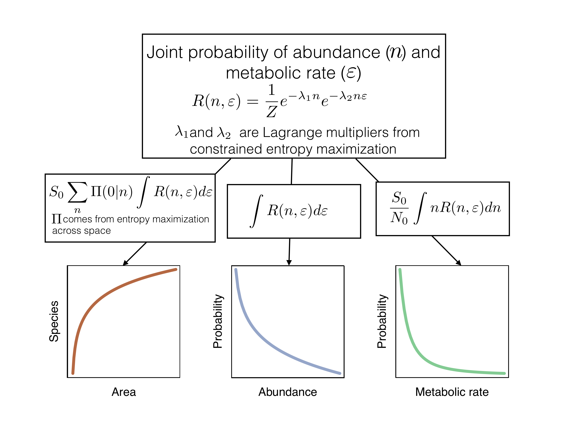
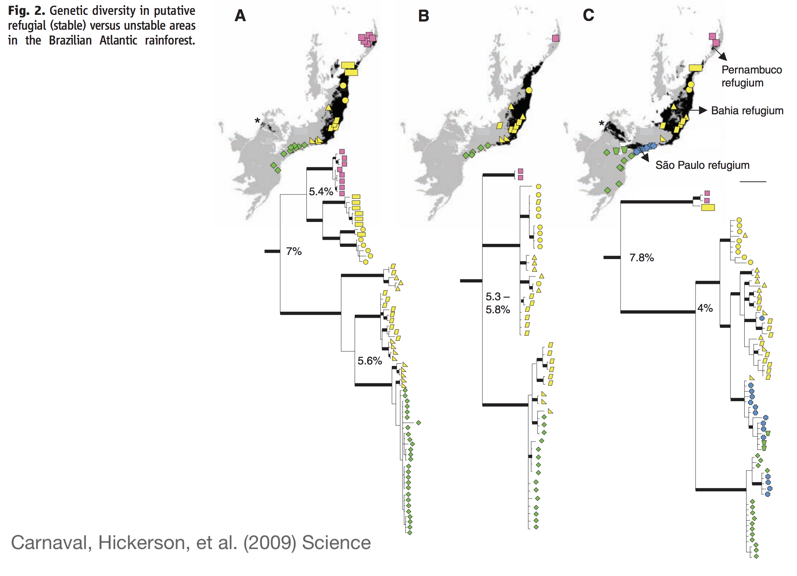

---
title: Three Tree of Life Inspired Approaches to Tropical Hyperdiversity
author: Andrew Rominger
mode  : selfcontained
framework: impressjs
widgets: mathjax
github:
  user: ajrominger
  repo: talks 
url:
  lib: ../libraries
--- #title x:0 y:0 scale:2
Three Tree-of-Life-Inspired Approaches to Tropical Hyperdiversity<br/>
<br/>
Andy Rominger

```{r, echo = FALSE}
x0 <- -1000
y <- 1500
xpls <- 1000
x <- x0
```

--- .slide x:`r x` y:`r y`

<q>Why are tropical rainforests so diverse?</q>
</br>

<li>Are their dynamics transient or equilibrial?</li>
<li>Is their equilibrium diversity higher?</li>
<li>Is their diversity maintained above equilibrium?</li>
<li>Are other areas below equilibrium?</li>
<li>Are ecological interactions stronger?</li>
<li>Is diversification in tropical rainforest unique?</li>


```{r, echo = FALSE}
x <- x0
y <- y + 1000
```


--- .slide x:`r x` y:`r y`

<q>Approach 1: <br/>Quantifying equilibrium with the Maximum Entropy Theory of Ecology</q>

```{r, echo = FALSE}
x <- x + xpls
```


--- .slide x:`r x` y:`r y`

**The Maximum Entropy Theory of Ecology (METE)** provides a prediction for an assemblage in *statistical* steady state.

```{r, meteExplc, fig.width = 7, fig.height = 6, fig.align = 'center', echo = FALSE, eval = TRUE, message = FALSE}

Ebreak <- cumsum(sort(0.03 + (1-0.03*12)*rmultinom(1,1000,rexp(11))[,1]/1000,decreasing=TRUE))
Ebreak <- c(0,Ebreak,1)

indAt <- seq(0.1,0.9,length=12)
sppAt <- seq(0.3,0.7,by=0.2)

par(mar=c(2.5, 0, 0.5, 0) + 0.1, mgp = c(1.5, 0.5, 0), cex = 2)
plot(1, type = 'n', xlim = c(0.4, 1), ylim = c(0, 1), xlab = '', axes = FALSE)

rect(0.9,0,1,1,col=hsv(0.42,0.6,0.6),border=NA)
segments(x0=0.9,x1=1,y0=Ebreak[2:12],col=hsv(0.42,0.6,0.8),lwd=2)

rect(0.65,indAt,0.75,indAt+0.03,col=hsv(0.6,0.3,0.7),border=NA)

for(i in 1:12) {
    polygon(x=c(0.75,0.75,0.9,0.9),
            y=c(indAt[i],indAt[i]+0.03,Ebreak[i+1],Ebreak[i]),
            col=hsv(0.42,0.6,0.8),border=hsv(0.42,0.6,0.8),lwd=0.2)
    
    if(i < 3) {
        polygon(x=c(0.65,0.65,0.45),
                y=c(indAt[i],indAt[i]+0.03,sppAt[1]),
                col=hsv(0.6,0.3,0.8),border=hsv(0.6,0.3,0.8))
    } else if(i < 7) {
        polygon(x=c(0.65,0.65,0.45),
                y=c(indAt[i],indAt[i]+0.03,sppAt[2]),
                col=hsv(0.6,0.3,0.8),border=hsv(0.6,0.3,0.8))
    } else {
        polygon(x=c(0.65,0.65,0.45),
                y=c(indAt[i],indAt[i]+0.03,sppAt[3]),
                col=hsv(0.6,0.3,0.8),border=hsv(0.6,0.3,0.8))
    }
}

points(rep(0.45,3),sppAt,cex=4,pch=21,bg=hsv(0.05,0.7,0.8))

axis(1,at=c(0.45,0.7,0.95),labels=c('Species','Individuals','Energy'))
```

It does so by seeking the least biased way of allocating metabolism to individuals and individuals to species. </br>
<span style="font-size:15px">Harte (2011) Oxford University Press; Rominger & Merow (2017) Methods in Ecology and Evolution</span>


```{r, echo = FALSE}
x <- x + xpls
```


--- .slide x:`r x` y:`r y`

**The Maximum Entropy Theory of Ecology (METE)** provides a prediction for an assemblage in *statistical* steady state.

```{r, metePred, fig.align = 'center', echo = FALSE, eval = TRUE, message = FALSE, out.width = '600px', out.height = '450px'}

```


It predicts many macroecological metrics of inerest. </br>
<span style="font-size:15px">Harte (2011) Oxford University Press; Rominger & Merow (2017) Methods in Ecology and Evolution</span>

```{r, echo = FALSE}
x <- x + xpls
```


--- .slide x:`r x` y:`r y`

Case Study: Across the Hawaiian chronosequence, METE reveals unique deviations from equilibrium in different arthropod guilds

```{r, mete_hawaii, fig.align = 'center', echo = FALSE, eval = TRUE, message = FALSE, out.width = '750px'}
knitr::include_graphics('assets/fig/fig_mete_hawaii.png')
```


```{r, echo = FALSE}
x <- x + xpls
```

--- .slide x:`r x` y:`r y`

<q>For all availible TRF plot data, compare METE predictions to observed, and then...<q/>

```{r, echo = FALSE}
x <- x + xpls
```


--- .slide x:`r x` y:`r y`

Evaluate if deviations from METE correlate with diversity or inferred diversification

```{r trfMETE_pred1, fig.width = 10, fig.height = 5, fig.align = 'center', echo = FALSE, eval = TRUE, message = FALSE}

layout(matrix(1:2, nrow = 1))
par(mar=c(2.5, 2.5, 1.5, 1) + 0.1, mgp = c(0.5, 0, 0), cex = 2)
curve(0.1 + 0*x, xlab = 'Standing diversity', ylab = 'Deviation from METE', lwd = 5,
      axes = FALSE, frame.plot = TRUE, col = hsv(0.7, 1, 0.7), 
      ylim = 0:1)
curve(0.7 + 0*x, lwd = 5, col = hsv(0.6, 0.6, 0.9), add = TRUE)
curve(1 - 1*x, lwd = 5, col = hsv(0, 0.6, 0.8), add = TRUE)
curve(1*x, lwd = 5, col = hsv(0.13, 1, 0.8), add = TRUE)
```
<span style="color: `r hsv(0.7, 1, 0.7)`">Local systems in equilibrium, no bearing on diversity</span></br>
<span style="color: `r hsv(0.6, 0.6, 0.9)`">Local systems **not** in equilibrium, no bearing on diversity</span>
<span style="color: `r hsv(0, 0.6, 0.8)`">Deviations from equilibrium linked to greater diversity</span></br>
<span style="color: `r hsv(0.13, 1, 0.8)`">Deviations from equilibrium linked to less diversity</span></br>

```{r, echo = FALSE}
x <- x + xpls
```

--- .slide x:`r x` y:`r y`

Evaluate if deviations from METE correlate with diversity or inferred diversification

```{r trfMETE_pred2, fig.width = 10, fig.height = 5, fig.align = 'center', echo = FALSE, eval = TRUE, message = FALSE}

layout(matrix(2:1, nrow = 1))
par(mar=c(2.5, 1, 1.5, 2.5) + 0.1, mgp = c(0.5, 0.5, 0), cex = 2, xpd = NA)
curve(0.1 + 0*x, xlab = '', ylab = 'Deviation from METE', lwd = 5,
      axes = FALSE, frame.plot = TRUE, col = hsv(0.7, 1, 0.7), 
      ylim = 0:1)
axis(1, at = 0.5, label = 0, tcl = -0.4)
mtext('Diversification rate', side = 1, line = 1.2, cex = 2)
curve(0.7 + 0*x, lwd = 5, col = hsv(0.6, 0.6, 0.9), add = TRUE)
curve(4 * (x - 0.5)^2, lwd = 5, col = hsv(0, 0.6, 0.8), add = TRUE)
```
<span style="color: `r hsv(0.7, 1, 0.7)`">Local systems in equilibrium, no bearing on diversification</span></br>
<span style="color: `r hsv(0.6, 0.6, 0.9)`">Local systems **not** in equilibrium, no bearing on diversification</span></br>
<span style="color: `r hsv(0, 0.6, 0.8)`">Deviations from equilibrium linked to higher rates (+ and -)</span></br>

```{r, echo = FALSE}
x <- x + xpls
```

--- .slide x:`r x` y:`r y`

Evaluate if deviations from METE correlate with diversity or inferred diversification

```{r trfMETE_pred3, fig.width = 10, fig.height = 5, fig.align = 'center', echo = FALSE, eval = TRUE, message = FALSE}

layout(matrix(2:1, nrow = 1))

par(mar=c(2.5, 1, 1.5, 2.5) + 0.1, mgp = c(0.5, 0.5, 0), cex = 2, xpd = NA)
curve(0.1 + 0*x, xlab = '', ylab = 'Deviation from METE', lwd = 5,
      axes = FALSE, frame.plot = TRUE, col = hsv(0.7, 1, 0.7), 
      ylim = 0:1)
axis(1, at = 0.5, label = 0, tcl = -0.4)
mtext('Diversification rate', side = 1, line = 1.2, cex = 2)
curve(0.7 + 0*x, lwd = 5, col = hsv(0.6, 0.6, 0.9), add = TRUE)
curve(4 * (x - 0.5)^2, lwd = 5, col = hsv(0, 0.6, 0.8), add = TRUE)

par(mar=c(2.5, 2.5, 1.5, 1) + 0.1, mgp = c(0.5, 0, 0), cex = 2)
curve(0.1 + 0*x, xlab = 'Standing diversity', ylab = 'Deviation from METE', lwd = 5,
      axes = FALSE, frame.plot = TRUE, col = hsv(0.7, 1, 0.7), 
      ylim = 0:1)
curve(0.7 + 0*x, lwd = 5, col = hsv(0.6, 0.6, 0.9), add = TRUE)
curve(1 - 1*x, lwd = 5, col = hsv(0, 0.6, 0.8), add = TRUE)
curve(1*x, lwd = 5, col = hsv(0.13, 1, 0.8), add = TRUE)
```
In combination these perspectives reveal effects of processes across timescales on equilibrium, transience, and diversity.

```{r, echo = FALSE}
x <- x + xpls
```


--- .slide x:`r x` y:`r y`
Use DAISIE model to estimate diversification
</br>
</br>
```{r DAISIE, fig.width = 10, fig.height = 5, fig.align = 'center', echo = FALSE, eval = TRUE, message = FALSE}
library(ape)
set.seed(1)
tre <- rphylo(16, 1, 0.9)

layout(matrix(1:2, nrow = 1))

par(mar = rep(0.5, 4), cex = 1.5)
plot(tre, show.tip.label = FALSE, x.lim = c(0, 5), y.lim = c(-1.5, 17), edge.width = 5,
     panel.first = {
         rect(1.75, 0.45, 4.25, 9.5, col = 'gray85', border = NA)
     })

rect(-1, -1, 1.75, 17, col = 'white', border = NA)
rect(-1, 9.55, 5, 17, col = 'white', border = NA)
segments(x0 = 0.25, x1 = 1.75, y0 = c(1, 2.5, 4, 6.63), lwd = 5, lty = 3)

text(0.9, -1, labels = 'Immigration')
text(3.25, -1, labels = 'Speciation')
box()


par(mar = rep(0.5, 4), cex = 1.5)
plot(tre, show.tip.label = FALSE, x.lim = c(0, 5), y.lim = c(-1.5, 17), edge.width = 5,
     panel.first = {
         rect(0.5, -0.45, 4.75, 16.5, col = 'gray70', border = NA)
     })


rect(-1, -1, 0.5, 17, col = 'white', border = NA)
segments(x0 = 0, x1 = 0.5, y0 = c(4.75, 14.125), lwd = 5, lty = 3)

text(0.15, -1, labels = 'Imm.')
text(3.25, -1, labels = 'Speciation')
box()
```
</br>
The model was designed for islands, but we could use it across scales on continents in combination with ancestral area reconstructions (e.g. BayArea)

```{r, echo = FALSE}
x <- x + xpls
```


--- .slide x:`r x` y:`r y`
Evaluate if deviations from METE correlate with ecosystem "age" or "stability"
</br>
</br>
```{r, age_mete, fig.width = 6, fig.height = 6, fig.align = 'center', echo = FALSE, eval = TRUE, message = FALSE}
x1 <- rnorm(20, 2, 0.4)
x2 <- rnorm(20, 0, 0.25)

par(mar=c(2.5, 2.5, 0, 0) + 0.1, mgp = c(0.5, 0.5, 0), cex = 2)
plot(rep(1:2, each = length(x1)), c(x1, x2), pch = 21, bg = hsv(0, 1, 0, alpha = 0.25), 
     axes = FALSE, frame.plot = TRUE, xlab = '', ylab = 'Deviation from METE', 
     lwd = 3, cex = 1.2, xlim = c(0.5, 2.5))
axis(1, at = 1:2, labels = c('Non-stable', 'Stable'))
```


```{r, echo = FALSE}
x <- x + xpls
```


--- .slide x:`r x` y:`r y`
Estimate "age" or "stability" with species distribution models and phylogeography
</br>
</br>
```{r, carnaval, fig.align = 'center', echo = FALSE, eval = TRUE, message = FALSE, out.width = '750px'}

```

```{r, echo = FALSE}
x <- x + xpls
```


```{r, echo = FALSE}
x <- x0
y <- y + 1000
```

--- .slide x:`r x` y:`r y`

<q>Approach 2: <br/>Quantifying process with the Massive Eco-evolutionary Synthesis Simulation</q>

```{r, echo = FALSE}
x <- x + xpls
```

--- .slide x:`r x` y:`r y`

What a MESS! (__M__assive __E__co-evolution __S__ynthesis __S__imulation)
</br>
</br>
```{r, mess_dag, fig.align = 'center', echo = FALSE, eval = TRUE, message = FALSE, out.width = '800px'}
knitr::include_graphics('assets/fig/mess_dag.png')
```

```{r, echo = FALSE}
x <- x + xpls
```


--- .slide x:`r x` y:`r y`

Resonates with "Plant phylogeny as a window on the evolution of hyperdiversity in the tropical rainforest biome"
</br>
</br>
```{r, wolf_dag, fig.align = 'center', echo = FALSE, eval = TRUE, message = FALSE, out.width = '600px'}
knitr::include_graphics('assets/fig/fig_wolf.png')
```

```{r, echo = FALSE}
x <- x + xpls
```


--- .slide x:`r x` y:`r y`
Parameter inference with MESS
</br>
</br>
```{r, mess_infer, fig.align = 'center', echo = FALSE, eval = TRUE, message = FALSE, out.width = '800px'}
knitr::include_graphics('assets/fig/fig_mess-infer.png')
```


```{r, echo = FALSE}
x <- x + xpls
```


--- .slide x:`r x` y:`r y`
Hypothesis testing with MESS
</br>
</br>
```{r, mess_hyp, fig.width = 6, fig.height = 6, fig.align = 'center', echo = FALSE, eval = TRUE, message = FALSE}
x1 <- rbeta(20, 3, 10)
x2 <- rbeta(20, 5, 1)

par(mar=c(2.5, 2.5, 0, 0) + 0.1, mgp = c(0.5, 0.5, 0), cex = 2)
plot(rep(1:2, each = length(x1)), c(x1, x2), pch = 21, bg = hsv(0, 1, 0, alpha = 0.25), 
     axes = FALSE, frame.plot = TRUE, xlab = '', ylab = 'Proportion of equilibrium', 
     lwd = 3, cex = 1.2, xlim = c(0.5, 2.5))
axis(1, at = 1:2, labels = c('Non-stable', 'Stable'))
```
Evaluate consequence of stability on eco-evo equilibrium

```{r, echo = FALSE}
x <- x + xpls
```


--- .slide x:`r x` y:`r y`
Hypothesis testing with MESS
</br>
</br>
```{r, mess_hyp-role, fig.align = 'center', echo = FALSE, eval = TRUE, message = FALSE, out.width = '550px'}
knitr::include_graphics('assets/fig/fig_mess-hyp.png')
```

```{r, echo = FALSE}
x <- x + xpls
```


```{r, echo = FALSE}
x <- x0
y <- y + 1000
```

--- .slide x:`r x` y:`r y`

<q>Approach 3: </br>Is diversification in the TFR Biome different?</q>

```{r, echo = FALSE}
x <- x + xpls
```

--- .slide x:`r x` y:`r y`

Combining phylogenies and range maps, let's ask if clade occupancy in the TFR is relevant to diversification, via...

```{r phylo_range_prep, echo = FALSE, eval = TRUE, message = FALSE, include = FALSE}
library(BIEN)
library(sp)
library(rgdal)
library(maps)
library(ape)

BIEN_ranges_species('Attalea speciosa')
atsp <- readOGR('./', 'Attalea_speciosa')
set.seed(200)
tre <- rphylo(24, 1, 0.9)
```
</br>
</br>
```{r phylo_range, fig.width = 10, fig.height = 5, fig.align = 'center', echo = FALSE, eval = TRUE, message = FALSE}
layout(matrix(1:2, nrow = 1))
par(mar = c(0, 0, 0, 1))
plot(tre, show.tip.label = FALSE, edge.width = 4)

par(mar = c(0, 1, 0, 0))
map(fill = TRUE, col = 'gray', xlim = c(-95, -20), ylim = c(-55, 30), lwd = 0.01)
map(add = TRUE, col = 'gray', lwd = 1, xlim = c(-95, -20), ylim = c(-55, 30))
text(-35, 10, labels = expression(italic('Attalea speciosa')), cex = 1.5)
plot(atsp, col = hsv(0.45, 0.8, 0.9), add = TRUE)
```

```{r, echo = FALSE}
x <- x + xpls
```

--- .slide x:`r x` y:`r y`

Comparing structure of "community phylogenies" from pixels in TRF and non-TFR regions
</br>
</br>
</br>
```{r phylo_comp1, fig.width = 10, fig.height = 5, fig.align = 'center', echo = FALSE, eval = TRUE, message = FALSE}

layout(matrix(1:2, nrow = 1))

par(mar = c(1.5, 1.5, 0, 1), mgp = c(0.5, 0, 0), cex = 2)
xx <- c(0, seq(0, 10, length.out = 100), 10)
xx0 <- c(0, seq(0, 10, length.out = 100), 1000)
curve(dgamma(x, 2, 1), from = 0, to = 10, xlab = 'Pairwise phylo dist', ylab = 'Density', 
      axes = FALSE, frame.plot = TRUE, type = 'n')
polygon(xx, dgamma(xx0, 2, 1), col = hsv(0.7, 0.7, 1, alpha = 0.5), border = hsv(0.7, 0.7, 1), 
        lwd = 4)
polygon(xx, dgamma(xx0, 8, 1.5), col = hsv(0.4, 1, 0.8, alpha = 0.5), border = hsv(0.4, 1, 0.8), 
        lwd = 4)

par(mar = c(0, 1, 0, 0))
map(fill = TRUE, col = 'gray', xlim = c(-95, -20), ylim = c(-55, 35), lwd = 0.01)
map(add = TRUE, col = 'gray', lwd = 1, xlim = c(-95, -20), ylim = c(-55, 35))
points(c(-55, -85), c(-10, 37), lwd = 3, pch = 22, cex = 2, 
       bg = hsv(c(0.4, 0.7), c(1, 0.7), c(0.8, 1)))
```

```{r, echo = FALSE}
x <- x + xpls
```


--- .slide x:`r x` y:`r y`

Comparing range through time patterns of "community phylogenies" from pixels in TRF and non-TFR regions
</br>
</br>
</br>
```{r phylo_comp2, fig.width = 10, fig.height = 5, fig.align = 'center', echo = FALSE, eval = TRUE, message = FALSE}

layout(matrix(1:2, nrow = 1))

par(mar = c(1.5, 1.5, 0, 1), mgp = c(0.5, 0, 0), cex = 2)
expit <- function(x, a, b) a + 1/(1 + b*exp(-x))

xx <- seq(-10, 1, length.out = 100)

plot(1, xlim = c(-10, 1), ylim = c(0, 1.1), type = 'n', xlab = 'Phylo dist', 
     ylab = 'Range overlap', axes = FALSE, frame.plot = TRUE)
polygon(c(xx, rev(xx)), c(expit(xx, 0.1, 0.005), expit(rev(xx), 0, 4)), lwd = 4,
        col = hsv(0.4, 1, 0.8, alpha = 0.5), border = hsv(0.4, 1, 0.8))
polygon(c(xx, rev(xx)), c(expit(xx, 0.08, 0.5), expit(rev(xx), 0, 20)), lwd = 4,
        col = hsv(0.7, 0.7, 1, alpha = 0.5), border = hsv(0.7, 0.7, 1))


par(mar = c(0, 1, 0, 0))
map(fill = TRUE, col = 'gray', xlim = c(-95, -20), ylim = c(-55, 35), lwd = 0.01)
map(add = TRUE, col = 'gray', lwd = 1, xlim = c(-95, -20), ylim = c(-55, 35))
points(c(-55, -85), c(-10, 37), lwd = 3, pch = 22, cex = 2, 
       bg = hsv(c(0.4, 0.7), c(1, 0.7), c(0.8, 1)))
```

```{r, echo = FALSE}
x <- x + xpls
```


--- .slide x:`r x` y:`r y`

Competing explicit state-dependent diversification models with and without TRF effects

```{r, sse, fig.align = 'center', echo = FALSE, eval = TRUE, message = FALSE, out.width = '550px'}
knitr::include_graphics('assets/fig/fig_sse.png')
```

SecSSE models have been shown to be robust to Type I error </br>
<span style="font-size:20px">Herrera-Alsina, et al. (2018) Systematic Biology</span>


```{r, echo = FALSE}
x <- x + xpls
```


--- .slide x:`r x` y:`r y`

Hyperdiverse ecosystems are tied to hyperdominance</br>
</br>
But exisiting diversification models are silent or ignorant about abundance
</br>
</br>
```{r, speciation_abund, fig.width = 10, fig.height = 4, fig.align = 'center', echo = FALSE, eval = TRUE, message = FALSE}

layout(matrix(1:3, nrow = 1))
par(mar = c(1, 1, 1, 0) + 0.5, mgp = c(0.5, 0, 0), cex = 1.5)

curve(1*x, xlab = 'Number of species', ylab = 'Speciation rate', 
      lwd = 4, axes = FALSE, frame.plot = TRUE, main = 'Linear birth-death')

curve(1*x, xlab = 'Number of individuals', ylab = 'Speciation rate', 
      lwd = 4, axes = FALSE, frame.plot = TRUE, main = 'Neutral theory')

plot(1, type = 'n', axes = FALSE, frame.plot = TRUE, xlab = '', ylab = '')
text(1, 1, labels = 'What about diverse\nbut rare clades?')
```
</br>
The link between rarity and diversification is not well known; understanding it could help explain hyperdiversity


```{r, echo = FALSE}
x <- x + xpls
```
