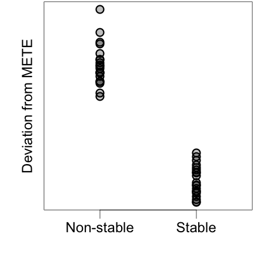
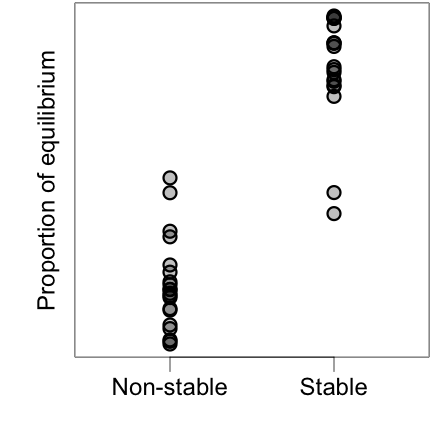

---
title: Three Tree of Life Inspired Approaches to Tropical Hyperdiversity
author: Andrew Rominger
mode  : selfcontained
framework: impressjs
widgets: mathjax
github:
  user: ajrominger
  repo: talks 
url:
  lib: ../libraries
--- #title x:0 y:0 scale:2
Three Tree-of-Life-Inspired Approaches to Tropical Hyperdiversity 
 
Andy Rominger

--- .slide x:-1000 y:1500

<q>Why are tropical rainforests so diverse?</q>
 

<li>Are their dynamics transient or equilibrial?</li>
<li>Is their equilibrium diversity higher?</li>
<li>Is their diversity maintained above equilibrium?</li>
<li>Are other areas below equilibrium?</li>
<li>Are ecological interactions stronger?</li>
<li>Is diversification in tropical rainforest unique?</li>

--- .slide x:-1000 y:2500

<q>Approach 1:  Quantifying equilibrium with the Maximum Entropy Theory of Ecology</q>

--- .slide x:0 y:2500

**The Maximum Entropy Theory of Ecology (METE)** provides a prediction for an assemblage in *statistical* steady state.

It does so by seeking the least biased way of allocating metabolism to individuals and individuals to species.  
Harte (2011) Oxford University Press; Rominger & Merow (2017) Methods in Ecology and Evolution

--- .slide x:1000 y:2500

**The Maximum Entropy Theory of Ecology (METE)** provides a prediction for an assemblage in *statistical* steady state.

It predicts many macroecological metrics of inerest.  
Harte (2011) Oxford University Press; Rominger & Merow (2017) Methods in Ecology and Evolution

--- .slide x:2000 y:2500

Case Study: Across the Hawaiian chronosequence, METE reveals unique deviations from equilibrium in different arthropod guilds

--- .slide x:3000 y:2500

<q>For all availible TRF plot data, compare METE predictions to observed, and then...<q/>

--- .slide x:4000 y:2500

Evaluate if deviations from METE correlate with diversity or inferred diversification

Local systems in equilibrium, no bearing on diversity 
Local systems **not** in equilibrium, no bearing on diversity
Deviations from equilibrium linked to less diversity 
Deviations from equilibrium linked to greater diversity 

--- .slide x:5000 y:2500

Evaluate if deviations from METE correlate with diversity or inferred diversification

Local systems in equilibrium, no bearing on diversification 
Local systems **not** in equilibrium, no bearing on diversification 
Deviations from equilibrium linked to higher rates (+ and -) 

--- .slide x:6000 y:2500

Evaluate if deviations from METE correlate with diversity or inferred diversification

In combination these perspectives reveal effects of processes across timescales on equilibrium, transience, and diversity.

--- .slide x:7000 y:2500
Use DAISIE model to estimate diversification
 
 

 
The model was designed for islands, but we could use it across scales on continents in combination with ancestral area reconstructions (e.g. BayArea)

Valente, et al. (2015) Ecology Letters; Landis, et al. (2013) Systematic Biology

--- .slide x:8000 y:2500
Evaluate if deviations from METE correlate with ecosystem "age" or "stability"
 
 

--- .slide x:9000 y:2500
Estimate "age" or "stability" with species distribution models and phylogeography
 
 

--- .slide x:-1000 y:3500

<q>Approach 2:  Quantifying process with the Massive Eco-evolutionary Synthesis Simulation</q>

--- .slide x:0 y:3500

What a MESS! (__M__assive __E__co-evolution __S__ynthesis __S__imulation)
 
 

--- .slide x:1000 y:3500

Resonates with "Plant phylogeny as a window on the evolution of hyperdiversity in the tropical rainforest biome"
 
 

--- .slide x:2000 y:3500
Parameter inference with MESS
 
 

--- .slide x:3000 y:3500
Hypothesis testing with MESS
 
 

Evaluate consequence of stability on eco-evo equilibrium

--- .slide x:4000 y:3500
Hypothesis testing with MESS
 
 

--- .slide x:-1000 y:4500

<q>Approach 3:  Is diversification in the TFR Biome different?</q>

--- .slide x:0 y:4500

Combining phylogenies and range maps, let's ask if clade occupancy in the TFR is relevant to diversification, via...

 
 

--- .slide x:1000 y:4500

Comparing structure of "community phylogenies" from pixels in TRF and non-TFR regions
 
 
 

--- .slide x:2000 y:4500

Comparing range through time patterns of "community phylogenies" from pixels in TRF and non-TFR regions
 
 
 

--- .slide x:3000 y:4500

Competing explicit state-dependent diversification models with and without TRF effects

SecSSE models have been shown to be robust to Type I error  
Herrera-Alsina, et al. (2018) Systematic Biology

--- .slide x:4000 y:4500

Hyperdiverse ecosystems are tied to hyperdominance 
 
But exisiting diversification models are silent or ignorant about abundance
 
 

 
The link between rarity and diversification is not well known; understanding it could help explain hyperdiversity

