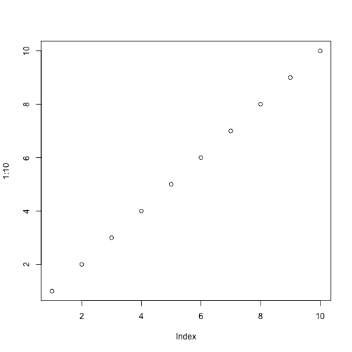

---
title: Anthropogenic change and biodiversity
author: Andrew J Rominger
mode  : selfcontained
framework: impressjs
widgets: mathjax
url:
  lib: ../libraries
--- # title .slide x:0 y:-1500

# Anthropogenic change and biodiversity


--- # slide 1 .slide x:1000 y:-1500
## Hello world

```r
plot(1:10)
```



--- # slide 2 .slide x:2000 y:-1500
## <div/>
$$
f(x) = exp(-x^2)
$$
