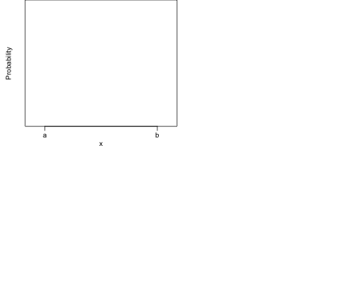
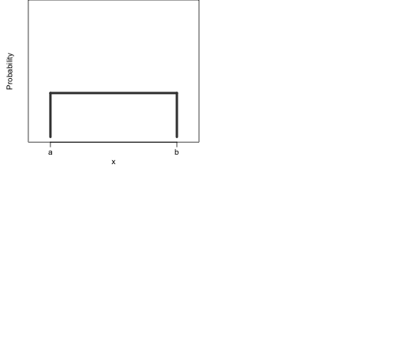
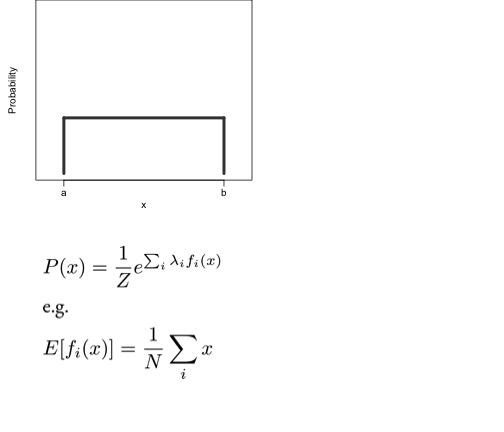
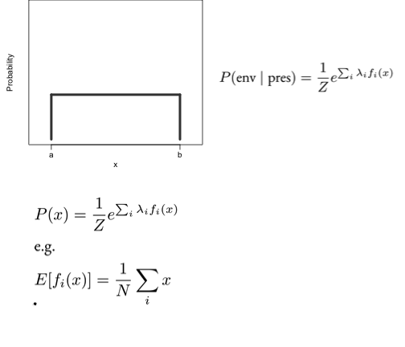
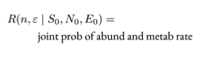
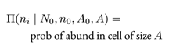
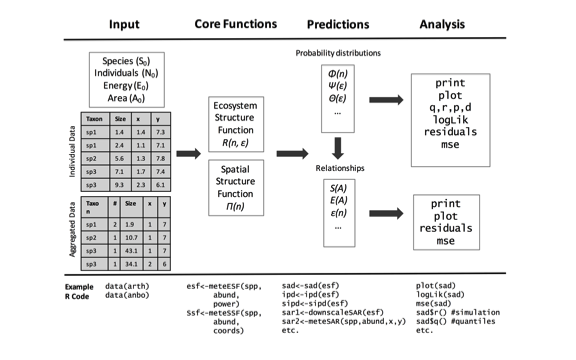

## {.columns-2}


## {.columns-2}


```
## Error in library(maps): there is no package called 'maps'
```

```
## Error in map("world", "mexico", col = c(rep("white", 7), "gray"), fill = TRUE, : could not find function "map"
```

```
## Error in plot.xy(xy.coords(x, y), type = type, ...): plot.new has not been called yet
```

## {.columns-2}


```
## Error in library(maps): there is no package called 'maps'
```

```
## Error in map("world", "mexico", col = c(rep("white", 7), "gray"), fill = TRUE, : could not find function "map"
```

```
## Error in plot.xy(xy.coords(x, y), type = type, ...): plot.new has not been called yet
```


```
## Error in library(socorro): there is no package called 'socorro'
```

```
## Error in library(meteR): there is no package called 'meteR'
```

```
## Error in sad(meteESF(S0 = 100, N0 = 1000)): could not find function "sad"
```

```
## Warning in xy.coords(x, y, xlabel, ylabel, log): 20 y values <= 0 omitted
## from logarithmic plot
```

```
## Warning in min(x): no non-missing arguments to min; returning Inf
```

```
## Warning in max(x): no non-missing arguments to max; returning -Inf
```

```
## Error in plot.window(...): need finite 'ylim' values
```

```
## Error in logAxis(2): could not find function "logAxis"
```


```
## Error in logAxis(1): could not find function "logAxis"
```

```
## Error in logAxis(2): could not find function "logAxis"
```

## <span style="color: #FFFFFF">Maximum Entropy</span>


## Maximum Entropy


## Maximum Entropy


## Maximum Entropy


## Maximum Entropy


## Maximum Entropy

```
## Error in loadNamespace(name): there is no package called 'viridis'
```



## Maximum Entropy and Macroecology


## The core of METE {.columns-2}
<div style="font-size: 22px">
Ecosystem structure function (**ESF**)

Species abundance and metabolic rate distributions follow


Spatial structure function (**SSF**)

Spatial abundance distribution and species area relationship follow
</div>

## Why theory?

## Why theory?

```
## Warning in file(file, "rt"): cannot open file '/Users/andyrominger/
## Research/talks/esaIgnite_2013/scaleCollapseThr.csv': No such file or
## directory
```

```
## Error in file(file, "rt"): cannot open the connection
```

```
## Warning in file(file, "rt"): cannot open file '/Users/andyrominger/
## Research/talks/esaIgnite_2013/scaleCollapseData.csv': No such file or
## directory
```

```
## Error in file(file, "rt"): cannot open the connection
```

```
## Error in xy.coords(x, y, setLab = FALSE): object 'scaleC.thr' not found
```

```
## Error in xy.coords(x, y, setLab = FALSE): object 'scaleC.thr' not found
```

```
## Error in f1(x[x <= 3]): could not find function "f1"
```

```
## Error in xy.coords(x, y, xlabel, ylabel, log): object 'x2' not found
```

## Why theory?

```
## Error in xy.coords(x, y, xlabel, ylabel, log): object 'x2' not found
```

## Why theory?

```
## Error in plot(exp(scaleC.dat[, 1]), scaleC.dat[, 2], log = "x", xlab = "", : object 'scaleC.dat' not found
```

```
## Error in f1(x[x <= 3]): could not find function "f1"
```

## Why theory?

```
## Error in plot(exp(scaleC.dat[, 1]), scaleC.dat[, 2], log = "x", xaxt = "n", : object 'scaleC.dat' not found
```

```
## Error in f1(x[x <= 3]): could not find function "f1"
```

```
## Error in logAxis(1): could not find function "logAxis"
```

## *meteR*


## *meteR*

```r
install.packages('meteR') # we're live on CRAN!
devtools::install_github('cmerow/meteR') # dev version
library(meteR)
```

## *meteR*: Data + Core

```r
data(arth)
```

```
## Warning in data(arth): data set 'arth' not found
```

```r
head(arth, n = 3)
```

```
## Error in head(arth, n = 3): object 'arth' not found
```

## *meteR*: Data + Core

```r
data(arth)
```

```
## Warning in data(arth): data set 'arth' not found
```

```r
head(arth, n = 3)
```

```
## Error in head(arth, n = 3): object 'arth' not found
```

```r
arthESF <- meteESF(spp = arth$spp, abund = arth$count, 
                   power = arth$mass^0.75)
```

```
## Error in meteESF(spp = arth$spp, abund = arth$count, power = arth$mass^0.75): could not find function "meteESF"
```

```r
arthESF # this is the print method
```

```
## Error in eval(expr, envir, enclos): object 'arthESF' not found
```

## *meteR*: Data + Core

```r
length(unique(arth$spp))
```

```
## Error in unique(arth$spp): object 'arth' not found
```

```r
sum(arth$count)
```

```
## Error in eval(expr, envir, enclos): object 'arth' not found
```

```r
sum(arth$mass^0.75 / min(arth$mass^0.75))
```

```
## Error in eval(expr, envir, enclos): object 'arth' not found
```

## *meteR*: Data + Core

```r
length(unique(arth$spp))
```

```
## Error in unique(arth$spp): object 'arth' not found
```

```r
sum(arth$count)
```

```
## Error in eval(expr, envir, enclos): object 'arth' not found
```

```r
sum(arth$mass^0.75 / min(arth$mass^0.75))
```

```
## Error in eval(expr, envir, enclos): object 'arth' not found
```

```r
arthESF_stateVar <- meteESF(S0 = 76, N0 = 547, E0 = 15868.26)
```

```
## Error in meteESF(S0 = 76, N0 = 547, E0 = 15868.26): could not find function "meteESF"
```

## *meteR*: Data + Core

```r
data(anbo)
```

```
## Warning in data(anbo): data set 'anbo' not found
```

```r
head(anbo, n = 3)
```

```
## Error in head(anbo, n = 3): object 'anbo' not found
```

## *meteR*: Data + Core

```r
data(anbo)
```

```
## Warning in data(anbo): data set 'anbo' not found
```

```r
head(anbo, n = 3)
```

```
## Error in head(anbo, n = 3): object 'anbo' not found
```

```r
anboSSF <- meteSSF(spp = anbo$spp, sppID = 'gnwe', 
                   abund = anbo$count, row = anbo$row, 
                   col = anbo$column, A = 1, A0 = 16)
```

```
## Error in meteSSF(spp = anbo$spp, sppID = "gnwe", abund = anbo$count, row = anbo$row, : could not find function "meteSSF"
```

```r
anboSSF
```

```
## Error in eval(expr, envir, enclos): object 'anboSSF' not found
```

## *meteR*: Prediction + Analysis

```r
arthSAD <- sad(arthESF)
```

## *meteR*: Prediction + Analysis

```r
arthSAD <- sad(arthESF)
plot(arthSAD, ptype = 'rad')
```

```
## Error in sad(arthESF): could not find function "sad"
```

```
## Error in plot(arthSAD, ptype = "rad", log = "y", yaxt = "n"): object 'arthSAD' not found
```

```
## Error in logAxis(2): could not find function "logAxis"
```

## *meteR*: Prediction + Analysis

```r
arthSAD <- sad(arthESF)
plot(arthSAD, ptype = 'rad')
```

```
## Error in sad(arthESF): could not find function "sad"
```

```
## Error in plot(arthSAD, ptype = "rad", log = "y", yaxt = "n"): object 'arthSAD' not found
```

```
## Error in logAxis(2): could not find function "logAxis"
```

```r
logLik(arthSAD)
```

```
## Error in logLik(arthSAD): object 'arthSAD' not found
```

## *meteR*: Prediction + Analysis

```r
anboSAR <- meteSAR(spp = anbo$spp, abund = anbo$count, 
                   row = anbo$row, col = anbo$col, 
                   Amin = 1, A0 = 16)
plot(anboSAR)
```

```
## Error in meteSAR(spp = anbo$spp, abund = anbo$count, row = anbo$row, col = anbo$col, : could not find function "meteSAR"
```

```
## Error in plot(anboSAR, log = "xy", axes = FALSE, frame.plot = TRUE, add.legend = FALSE): object 'anboSAR' not found
```

## *meteR*: Prediction + Analysis

```r
anboSAR <- meteSAR(spp = anbo$spp, abund = anbo$count, 
                   row = anbo$row, col = anbo$col, 
                   Amin = 1, A0 = 16)
plot(anboSAR)
```

```
## Error in meteSAR(spp = anbo$spp, abund = anbo$count, row = anbo$row, col = anbo$col, : could not find function "meteSAR"
```

```
## Error in plot(anboSAR, log = "xy", axes = FALSE, frame.plot = TRUE, add.legend = FALSE): object 'anboSAR' not found
```

```r
mse(anboSAR)
```

```
## Error in mse(anboSAR): could not find function "mse"
```

## The Future

- *pika* package to integrate quantitative macroecology
    - standardized goodness of fit
    - more than just SAD, SAR, metabolism
    - will be on CRAN and module in *Wallace*
- *meteR* (and/or *pika*) to facilitate self-publishing of data and analyses

## {.flexbox .vcenter}
<span style="font-size: 64px; color:#515151;">Thanks!</span>
<br/>
<br/>
[ajrominger.github.io](ajrominger.github.io)
